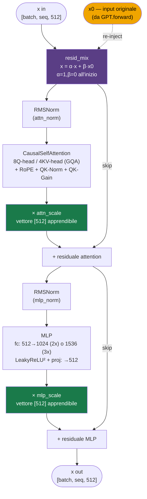
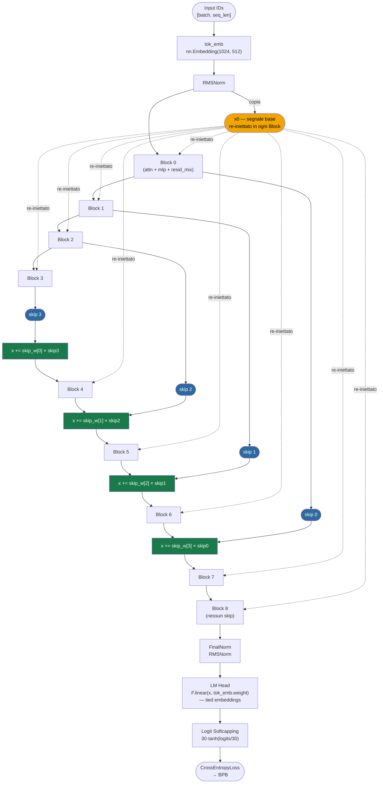
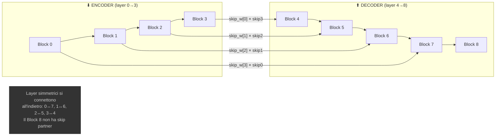

# Parameter Golf: Guida Tecnica Completa

> **Obiettivo della challenge**: Addestrare il miglior language model in un artefatto ≤16MB, in ≤10 minuti su 8×H100, valutato tramite compressione (BPB) sul validation set FineWeb. SOTA ufficiale: **1.1194 BPB** (#549). Best pending: **1.0806** (#1143).

---

## Indice
1. [La Competizione e i Vincoli](#1-la-competizione-e-i-vincoli)
2. [Il Dato: FineWeb e Tokenizzazione](#2-il-dato-fineweb-e-tokenizzazione)
3. [L'Architettura del Modello (riga per riga)](#3-larchitettura-del-modello)
4. [L'Ottimizzatore Muon](#4-lottimizzatore-muon)
5. [La Pipeline di Training](#5-la-pipeline-di-training)
6. [La Valutazione e il Metrico BPB](#6-la-valutazione-e-il-metrico-bpb)
7. [La Compressione: Quantizzazione INT8 + zlib](#7-la-compressione-quantizzazione-int8--zlib)
8. [Tutte le Migliorie della Community (Tier per Tier)](#8-tutte-le-migliorie-della-community)
9. [Idee su PCA per Compressione](#9-idee-su-pca-per-compressione)
10. [Roadmap per una PR Competitiva](#10-roadmap-per-una-pr-competitiva)
11. [Dizionario Completo delle Terminologie](#11-dizionario-completo-delle-terminologie)

---

## 1. La Competizione e i Vincoli

### Regole Fondamentali
- **Artefatto** ≤ 16,000,000 bytes (codice `train_gpt.py` + modello compresso `.ptz`)
- **Training** ≤ 10 min su 8×H100 SXM (600 secondi wallclock)
- **Evaluation** ≤ 10 min separati (budget aggiuntivo)
- **Nessun accesso alla rete** durante eval
- **Nessun uso dei dati di validazione durante il training**
- Nuovi record SOTA devono battere il precedente di ≥0.005 nats a p < 0.01 (tipicamente 3 seed)

### Cos'è il BPB
**Bits Per Byte** misura quanti bit il tuo modello necessita per codificare *ogni singolo byte* di testo. Shannon (1948) ha dimostrato che predizione e compressione sono matematicamente equivalenti:
- Un modello perfetto che predice ogni byte → 0 BPB
- Un modello che non capisce nulla → ~8 BPB (massimo)
- Baseline: **1.2244 BPB**
- SOTA ufficiale: **1.1194 BPB**
- Best pending (puro neurale): **1.0806 BPB**

Il BPB è tokenizer-agnostico: normalizza attraverso vocabolari diversi. Un vocabolario più grande produce meno token più informativi, ma il BPB cancella questo bias misurando la compressione di byte grezzi.

---

## 2. Il Dato: FineWeb e Tokenizzazione

### Pipeline dei Dati
I dati sono pre-processati in shard binari nella cartella `data/datasets/fineweb10B_sp1024/`:
- **Training**: `fineweb_train_*.bin` — fino a 80 shard (8B token)
- **Validation**: `fineweb_val_*.bin` — set fisso dei primi 50k documenti

Ogni shard ha un header di 256 int32 (magic number `20240520`, versione, conteggio token) seguito da token codificati come `uint16`.

### Tokenizzatore
- **SentencePiece** BPE con vocabolario di **1024 token** (`fineweb_1024_bpe.model`)
- Vocabolario piccolo = embedding compatto (solo 1024 × 512 = 524K parametri)
- La scelta è deliberata: con il limite di 16MB, ogni byte usato per l'embedding è un byte sottratto ai layer

### Caricamento Dati (`TokenStream` + `DistributedTokenLoader`)

```python
class TokenStream:
    # Legge shard sequenzialmente e ricomincia da capo all'infinito.
    # Comportamento deterministico senza shuffle random.
```

Il `DistributedTokenLoader` prende `global_tokens` per step, li divide equamente tra i rank (GPU) e produce coppie `(x, y)` dove:
- `x` = input token (sequenza di lunghezza `train_seq_len=1024`)
- `y` = target token (shift di 1 posizione a destra)

**Innovazione dalla community**: Il **Coprime-Stride Loader** (#726, usato nel SOTA #1060) campiona blocchi con stride primo rispetto al numero di shard, ottenendo maggiore diversità nei batch senza overhead.

---

## 3. L'Architettura del Modello

### 3.1. Vista d'Insieme

Il modello è un **Transformer decoder-only con architettura U-Net**, composto da:

| Componente | Default | Parametri |
|---|---|---|
| Embedding | vocab_size=1024, dim=512, tied | ~524K |
| Transformer Blocks | 9 layers | ~17M |
| Skip Connections | 4 coppie pesate | ~2K |
| Final RMSNorm | Senza parametri apprendibili | 0 |
| Totale | | ~17.5M |

### 3.2. Token Embedding e Normalizzazione Iniziale

```python
# file: train_gpt.py, GPT.forward(), righe 703-706
x = self.tok_emb(input_ids)       # [batch, seq_len] → [batch, seq_len, 512]
x = F.rms_norm(x, (x.size(-1),))  # Normalizza subito l'embedding
x0 = x                             # Salva il tensore iniziale per l'iniezione residuale
```

**Punti chiave:**
- L'embedding è un semplice `nn.Embedding(1024, 512)` inizializzato con `Normal(0, 0.005)` quando tied
- L'`RMSNorm` subito dopo l'embedding stabilizza l'ingresso nella rete
- `x0` è il "segnale di base" che verrà re-iniettato in ogni singolo blocco

### 3.3. RMSNorm (Root Mean Square Normalization)

```python
class RMSNorm(nn.Module):
    def forward(self, x: Tensor) -> Tensor:
        return F.rms_norm(x, (x.size(-1),), eps=self.eps)
```

A differenza di LayerNorm, **non ha parametri apprendibili** (niente gamma/beta). Formula:
```
RMSNorm(x) = x / sqrt(mean(x²) + ε)
```
Vantaggi: più veloce, più stabile numericamente, meno parametri da salvare nell'artefatto.

### 3.4. CastedLinear (Matmul in Precisione Mista)

```python
class CastedLinear(nn.Linear):
    def forward(self, x: Tensor) -> Tensor:
        return F.linear(x, self.weight.to(x.dtype), bias)
```

**Trucco cruciale**: i pesi sono **mantenuti in fp32** per qualità dell'ottimizzatore, ma vengono **castati a bf16 al momento della moltiplicazione**. Questo dà il meglio dei due mondi:
- Muon/Adam lavorano su gradienti fp32 precisi
- Il forward pass è veloce in bf16
- Dopo il training, i pesi vengono comunque quantizzati a INT8 (o INT6)

### 3.5. Rotary Position Embedding (RoPE)

```python
class Rotary(nn.Module):
    def __init__(self, dim: int, base: float = 10000.0):
        inv_freq = 1.0 / (base ** (torch.arange(0, dim, 2) / dim))
```

RoPE inietta informazione posizionale **ruotando** i vettori query e key nello spazio degli angoli, con:
- Frequenze basse per le dimensioni "alte" (catturano pattern a lungo raggio)
- Frequenze alte per le dimensioni "basse" (catturano vicinanza locale)

```python
def apply_rotary_emb(x, cos, sin):
    x1, x2 = x[..., :half], x[..., half:]
    return cat((x1*cos + x2*sin, x1*(-sin) + x2*cos), dim=-1)
```

**Miglioramento dalla community — Partial RoPE (#315):**
Applica RoPE solo al 25% delle dimensioni (16 su 64 `head_dim`). Le 48 dimensioni rimanenti attendono senza codifica posizionale, imparando similarità semantica pura. Guadagno: **-0.001 BPB** a zero parametri.

### 3.6. CausalSelfAttention (Attention Multi-Head con GQA)

```python
class CausalSelfAttention(nn.Module):
    def __init__(self, dim=512, num_heads=8, num_kv_heads=4, ...):
        # 8 Query heads, 4 Key/Value heads (GQA 2:1)
        self.c_q = CastedLinear(512, 512)   # → 8 heads × 64 dim
        self.c_k = CastedLinear(512, 256)   # → 4 heads × 64 dim
        self.c_v = CastedLinear(512, 256)   # → 4 heads × 64 dim
        self.proj = CastedLinear(512, 512)  # Output projection (zero-init)
        self.q_gain = nn.Parameter(...)      # Per-head scalare di temperatura
```

**Il forward pass dell'attention, passo per passo:**

1. **Proiezione Q/K/V**: Input `x` → tre proiezioni lineari
2. **Reshape a multi-head**: `[batch, seq, dim]` → `[batch, heads, seq, head_dim]`
3. **QK-Norm (RMSNorm)**: `q = rms_norm(q)`, `k = rms_norm(k)` — stabilizza i logit dell'attention, impedisce esplosioni numeriche
4. **RoPE**: Applica rotazione posizionale a Q e K
5. **Q-Gain**: `q = q * q_gain[head]` — scalare **apprendibile per-head** che controlla la "nitidezza" dell'attenzione (temperatura inversa). Default 1.5, la community ha trovato che **4.0** funziona meglio (#1176)
6. **Scaled Dot-Product Attention**: `softmax(QK^T / √d) × V` con maschera causale
7. **GQA**: Ogni coppia di Q heads condivide 1 set di K/V (reduce memoria del 50%)
8. **Proiezione output**: Linear di ritorno a `dim`, inizializzata a **zero** (`_zero_init = True`)

**L'inizializzazione zero di `proj`** è critica: all'inizio del training, ogni blocco agisce come un'identità (`x + 0 = x`). Il modello parte "pulito" e impara incrementalmente cosa aggiungere.

### 3.7. MLP (Multi-Layer Perceptron) con Attivazione ReLU²

```python
class MLP(nn.Module):
    def __init__(self, dim=512, mlp_mult=2):
        # hidden = 2 × 512 = 1024 (baseline)
        self.fc = CastedLinear(512, 1024, bias=False)
        self.proj = CastedLinear(1024, 512, bias=False)  # zero-init

    def forward(self, x):
        x = torch.relu(self.fc(x))
        return self.proj(x.square())
```

**Attenzione**: l'architettura usa **ReLU²** (ReLU al quadrato), NON un semplice ReLU:
1. `relu(x)` → azzera i valori negativi
2. `.square()` → eleva al quadrato — dà **sparsità naturale del 84-98%** (la maggior parte degli output sono zero)

Questa sparsità altissima è un vantaggio perché:
- L'informazione è concentrata in poche attivazioni forti
- Essendo quasi tutto zero, potenzialmente sfruttabile con 2:4 sparsity di H100

**Miglioramento dalla community — LeakyReLU² (#434):**
```python
x = F.leaky_relu(self.fc(x), negative_slope=0.5)
return self.proj(x.square())
```
Invece di azzerare i negativi, li moltiplica per 0.5. Non "uccide" mai completamente le attivazioni. **Adottato da 10+ submission**, spread più rapido nella community.

**Miglioramento — MLP 3x (#70):**
Espandere `mlp_mult` da 2 a 3 (hidden = 1536). Più capacità espressiva, finanziato dal risparmio della quantizzazione INT6. **Universale** tra le submission competitive.

### 3.8. Block (Il Blocco Transformer)

```python
class Block(nn.Module):
    def __init__(self, dim, ...):
        self.attn_norm = RMSNorm()
        self.mlp_norm = RMSNorm()
        self.attn = CausalSelfAttention(...)
        self.mlp = MLP(...)
        self.attn_scale = nn.Parameter(torch.ones(dim))  # Peso residuale attn
        self.mlp_scale = nn.Parameter(torch.ones(dim))   # Peso residuale mlp
        self.resid_mix = nn.Parameter(                    # Mixing con x0
            torch.stack((torch.ones(dim), torch.zeros(dim)))
        )
```

**Il forward è il cuore dell'intera rete:**

```python
def forward(self, x, x0):
    # 1. RESIDUAL MIXING: mescola lo stato corrente con l'input originale
    mix = self.resid_mix
    x = mix[0] * x + mix[1] * x0
    
    # 2. ATTENTION + RESIDUALE SCALATO
    attn_out = self.attn(self.attn_norm(x))
    x = x + self.attn_scale * attn_out
    
    # 3. MLP + RESIDUALE SCALATO
    x = x + self.mlp_scale * self.mlp(self.mlp_norm(x))
    
    return x
```

#### Diagramma — Internals di un Block



**Tre innovazioni in un blocco:**

| Feature | Come Funziona | Perché |
|---|---|---|
| `resid_mix` | `[1,0] → [α,β]` apprendibile | Inizia come pass-through (`x`), impara quanto re-iniettare di `x0` |
| `attn_scale` | Vettore `[dim]` per l'attention | Modula dimensione-per-dimensione il contributo dell'attention |
| `mlp_scale` | Vettore `[dim]` per l'MLP | Modula dimensione-per-dimensione il contributo dell'MLP |

Queste scale **non sono normalizzazione** — sono pesi apprendibili nel residuale. Partono da `ones` e il modello impara a "regolare il volume" di ciascun sub-layer.

**Miglioramento — LN Scale (#315):**
Aggiungere un fattore `1/√(layer_idx+1)` dopo il RMSNorm → i layer profondi contribuiscono meno allo stream residuale, evitando che sovrascrivano le feature dei layer iniziali. Zero parametri extra, **-0.001 BPB**.

### 3.9. GPT: Il Modello Completo (Architettura U-Net)

```python
class GPT(nn.Module):
    def __init__(self, num_layers=9, ...):
        self.num_encoder_layers = 9 // 2  # = 4
        self.num_decoder_layers = 9 - 4    # = 5
        self.num_skip_weights = min(4, 5)  # = 4
        self.skip_weights = nn.Parameter(torch.ones(4, 512))
        self.blocks = nn.ModuleList([Block(...) for _ in range(9)])
```

#### Diagramma 1 — Flusso Completo della U-Net



> **Lettura del diagramma**:
> - **Arancione** = `x0`, il segnale iniziale normalizzato che viene re-iniettato in ogni Block via `resid_mix`.
> - **Blu** = skip connections accumulate dall'encoder. Vengono inserite in uno stack LIFO.
> - **Verde** = punti di iniezione delle skip nel decoder. Ogni skip è pesata da `skip_weights[i]` (vettore 512-dim apprendibile).

#### Diagramma 2 — Skip Connections: pattern simmetrico



### Come funzionano le Skip Connections

```python
# ENCODER: accumula skip
for i in range(4):
    x = self.blocks[i](x, x0)
    skips.append(x)

# DECODER: consuma skip in ordine inverso (LIFO)
for i in range(5):
    if skips:
        x = x + self.skip_weights[i] * skips.pop()
    x = self.blocks[4 + i](x, x0)
```

**skips.pop()** preleva l'ultimo elemento: il first-in-last-out crea un ponte tra layer simmetrici (0↔ultimo, 1↔penultimo...). `skip_weights` sono **apprendibili per dimensione** (512 valori) — il modello impara *quale* informazione dal layer simmetrico è utile.

### Output Head e Logit Softcapping

```python
# Tied embeddings: lm_head = tok_emb.weight (trasposta)
logits_proj = F.linear(x, self.tok_emb.weight)

# Softcapping: limita logit a [-30, +30] con tanh morbido
logits = 30.0 * torch.tanh(logits_proj / 30.0)

return F.cross_entropy(logits.float(), targets, reduction="mean")
```

Il **Softcapping** è essenziale per la stabilità: con LR aggressive (Muon usa `matrix_lr=0.04`), senza cap i logit esploderebbero. La funzione `30 * tanh(x/30)`:
- Per `|x| << 30` → si comporta come identità
- Per `|x| → ∞` → satura dolcemente a ±30

---

## 4. L'Ottimizzatore Muon

### Cos'è Muon
**MomentUm Orthogonalized by Newton-Schulz** — creato da Keller Jordan per il NanoGPT speedrun. È l'ottimizzatore per tutte le matrici 2D (i pesi lineari di attention e MLP).

### Come Funziona (Passo per Passo)

```python
class Muon(torch.optim.Optimizer):
    def step(self):
        for p in params:
            g = p.grad
            
            # 1. Momentum di Nesterov
            buf.mul_(momentum).add_(g)
            g = g.add(buf, alpha=momentum)
            
            # 2. Ortogonalizzazione Newton-Schulz (5 iterazioni)
            g = zeropower_via_newtonschulz5(g, steps=5)
            
            # 3. Correzione scala
            g *= max(1, rows/cols) ** 0.5
            
            # 4. Aggiornamento peso
            p.add_(g, alpha=-lr)
```

**L'ortogonalizzazione Newton-Schulz** è il cuore:
```python
def zeropower_via_newtonschulz5(G, steps=10):
    a, b, c = (3.4445, -4.7750, 2.0315)
    X = G.bfloat16()
    X /= X.norm()
    for _ in range(steps):
        A = X @ X.T
        B = b * A + c * A @ A
        X = a * X + B @ X
    return X
```

Prende il gradiente G e trova la matrice ortogonale più vicina. Intuitivamente: "pulisce" la direzione del gradiente rimuovendo ridondanze. Equivale al *steepest descent nella norma spettrale*, che ha migliori proprietà di condizionamento.

**Risultato**: ~35% più veloce di AdamW per language models.

### Split degli Ottimizzatori nel Codice

| Parametro | Ottimizzatore | Learning Rate |
|---|---|---|
| `tok_emb.weight` (embedding) | Adam | 0.05 (tied) / 0.6 (untied) |
| `lm_head.weight` (se non tied) | Adam | 0.008 |
| Matrici 2D nei blocks | **Muon** | 0.04 |
| Vettori 1D, scale, norme | Adam | 0.04 |
| `skip_weights` | Adam | 0.04 |

### Evoluzioni dalla Community

| Variante | Descrizione | Impatto |
|---|---|---|
| **Parallel Muon** (#399) | All-reduce distribuito ottimizzato | -3.1% tempo/step |
| **Turbo-Muon** (#1089) | AOL preconditioning + Polar Express coefficients | 5-10% più step |
| **Mousse** (arXiv:2603.09697) | Curvatura Shampoo + Muon | ~12% più efficience/step |
| **MUD** (arXiv:2603.17970) | Preconditioning triangolare, drop-in | 1.3-2.6× più veloce |

---

## 5. La Pipeline di Training

### Warmup (Compilazione + Riscaldamento)

```python
# 20 step di warmup (compilazione torch.compile + priming)
for warmup_step in range(20):
    # Forward + Backward su dati casuali
    warmup_loss = model(x, y)
    (warmup_loss * grad_scale).backward()
    optimizer.step()

# RESET totale: ripristina pesi e stati ottimizzatore
base_model.load_state_dict(initial_model_state)
```

Il warmup è **puramente tecnico**: forza `torch.compile` a compilare tutti i kernel, poi **ripristina completamente** i pesi iniziali. I 20 step non contano nel training reale.

### Gradient Accumulation

```python
grad_accum_steps = 8 // world_size  # 8 GPU → 1 step, 1 GPU → 8 step
grad_scale = 1.0 / grad_accum_steps
```

Con 1 GPU: si accumulano 8 micro-batch prima di fare un passo dell'ottimizzatore. Questo simula un batch effettivo di `8 × train_batch_tokens`. Con 8 GPU: ogni GPU fa 1 micro-batch, poi sincronizza i gradienti.

**Batch effettivo**: `train_batch_tokens × 8 = 524,288 × 8 = 4,194,304 token per step` (baseline)

### Learning Rate Schedule (Warmdown)

```python
def lr_mul(step, elapsed_ms):
    if remaining_ms <= warmdown_ms:
        return remaining_ms / warmdown_ms
    return 1.0
```

Il schedule è **basato sul tempo reale (wallclock)**, non sugli step! Questo è cruciale perché:
- Su hardware diversi gli step hanno durate diverse
- Il warmdown inizia automaticamente `warmdown_iters × ms_per_step` prima della fine dei 600s
- La LR scala linearmente da 1.0 a 0.0
- **Errore scoperto**: usare uno schedule step-based costa -0.483 BPB (#344)

### Momentum Warmup di Muon

```python
muon_momentum = (1 - frac) * 0.85 + frac * 0.95  # 0.85 → 0.95 in 500 step
```

Il momentum di Muon sale gradualmente nei primi 500 step. Momentum basso all'inizio evita che il modello overshootì sul landscape prima di aver visto abbastanza dati.

### Main Training Loop

```python
for step in range(iterations):
    # 1. Validation periodica (se configurata)
    # 2. Calcolo lr_scale basato su wallclock
    # 3. Forward + Backward per grad_accum_steps micro-batch
    # 4. Muon momentum warmup
    # 5. Applicazione lr_scale a tutti gli optimizers
    # 6. Gradient clipping (opzionale, default off)
    # 7. Optimizer step
    # 8. Check wallclock cap
```

---

## 6. La Valutazione e il Metrico BPB

### 6.0 Teoria dell'Informazione: Bit, Nats e Sorpresa

Per capire BPB bisogna partire da Shannon (1948). L'idea centrale è:

> **Informazione = sorpresa.** Più un evento è probabile, meno informazione porta.

#### Cos'è la Sorpresa (Self-Information)

Se un evento ha probabilità `p`, la sua **sorpresa** è definita come:

```
Sorpresa = -log(p)
```

La base del logaritmo sceglie l'unità di misura:
- **log₂** → unità = **bit**
- **logₑ** (logaritmo naturale, `ln`) → unità = **nat**

**Esempio concreto:**

| Evento | Probabilità p | Sorpresa (bits) | Sorpresa (nats) |
|---|---|---|---|
| "the" all'inizio di frase | 0.10 | -log₂(0.10) ≈ **3.32 bits** | -ln(0.10) ≈ **2.30 nats** |
| "quantum" dopo "the" | 0.001 | -log₂(0.001) ≈ **9.97 bits** | -ln(0.001) ≈ **6.91 nats** |
| Prossima parola nel SOTA | ~0.45 (in media) | ~**1.15 bits** | ~**0.80 nats** |

> La parola frequente "the" è poco sorprendente → pochi bit.
> La parola rara "quantum" è molto sorprendente → molti bit.

#### Conversione Bits ↔ Nats

```
1 nat = log₂(e) ≈ 1.4427 bits
1 bit = ln(2)   ≈ 0.6931 nats

bits = nats / ln(2) = nats × 1.4427
nats = bits × ln(2) = bits × 0.6931
```

**Perché PyTorch usa i nats?** Perché `torch.nn.functional.cross_entropy` usa internamente `log` = `ln`. È una scelta di implementazione, non concettuale. Il risultato è identico, cambia solo la scala.

#### L'Entropia: Sorpresa Media

L'**entropia di Shannon** H è la *media* della sorpresa su tutti gli eventi possibili:

```
H = -Σ p(x) × log(p(x))    per tutti i possibili x
```

**Esempio — distribuzione su 4 token:**

```
token "il":   p = 0.5  → sorpresa = -log₂(0.5) = 1.0 bit
token "la":   p = 0.3  → sorpresa = -log₂(0.3) ≈ 1.74 bit
token "un":   p = 0.15 → sorpresa = -log₂(0.15) ≈ 2.74 bit
token "ogni": p = 0.05 → sorpresa = -log₂(0.05) ≈ 4.32 bit

H = 0.5×1.0 + 0.3×1.74 + 0.15×2.74 + 0.05×4.32 ≈ 1.75 bit/token
```

Un modello perfetto che impara esattamente questa distribuzione avrebbe `loss = 1.75 bits = 1.21 nats` su questo vocabolario.

#### Cross-Entropy Loss: Sorpresa del Modello sul Testo Reale

La loss che PyTorch calcola è la **cross-entropy** tra la distribuzione reale del testo (la "verità") e la distribuzione predetta dal modello:

```
CE_loss = -log( p_modello(token_corretto) )   [in nats]
```

**Esempio numerico passo-passo:**

```
Testo reale: "il gatto mangia"
              ↓
Step 1: il modello vede "il" e deve predire il prossimo token

Distribuzione predetta dal modello:
  p("gatto")  = 0.40  ← corretto!
  p("cane")   = 0.25
  p("topo")   = 0.10
  p("mela")   = 0.05
  ... (1020 altri token)

Loss per questo token = -ln(0.40) ≈ 0.916 nats  ✓ abbastanza basso

Step 2: il modello vede "il gatto" e deve predire "mangia"
  p("mangia") = 0.02  ← corretto ma poco probabile
  p("dorme")  = 0.35
  p("corre")  = 0.20

Loss per questo token = -ln(0.02) ≈ 3.912 nats  ✗ alta: il modello era sorpreso

val_loss medio = (0.916 + 3.912) / 2 ≈ 2.41 nats
```

### 6.1 Da val_loss (Nats) a BPB

Il percorso completo dalla loss al BPB che vedi stampato:

```
val_loss (nats/token)
        │
        │  ÷ ln(2)                    # converti nats → bits
        ▼
bits_per_token
        │
        │  × (n_token / n_byte)       # normalizza per i byte grezzi del testo
        ▼
BPB (bits/byte)
```

**Perché normalizzare per i byte?**

Con vocabolario 1024 ogni token codifica in media ~3-4 caratteri. Con vocabolario 50k ogni token codifica ~4-6 caratteri. Senza normalizzazione, confrontare modelli con tokenizer diversi è impossibile. Il BPB riporta tutto alla stessa base: *quanti bit per ogni byte di testo ASCII/UTF-8 originale*.

**Esempio numerico end-to-end:**

```python
val_loss = 0.916    # nats (dal nostro esempio sopra, solo primo token)

# Passo 1: nats → bits
bits_per_token = 0.916 / 0.6931     # ln(2) ≈ 0.6931
bits_per_token ≈ 1.322 bits

# Passo 2: normalizza per i byte
# "il" → 2 byte, "gatto" → 5 byte, "mangia" → 6 byte = 13 byte totali
# 3 token per 13 byte → tokens_per_byte = 3/13 ≈ 0.231

BPB = 1.322 × 0.231 ≈ 0.305 BPB   ← solo su questa frasetta, molto ottimistico
```

> Nota: su testo reale con sequenze di migliaia di token, il BPB converge verso i valori realistici visti (1.1-1.2).

### 6.2 Interpretazione Intuitiva del BPB

```
BPB = 8.0  →  nessuna compressione (1 byte = 8 bit, il modello non ha imparato nulla)
BPB = 4.0  →  compressione 2:1 (capisce metà struttura del linguaggio)
BPB = 1.22 →  baseline della sfida (compressione ~6.5:1)
BPB = 1.12 →  SOTA competitivo (~7:1)
BPB = 1.08 →  best pending (~7.4:1)
BPB = 0.0  →  modello perfetto (impossibile sul testo naturale)
```

Il limite inferiore non è 0 ma l'**entropia vera del linguaggio** — stimata da Shannon intorno a 0.6-1.3 bits per carattere per l'inglese. Il nostro task è in nats-per-token su testo WebCrawl, quindi il "pavimento" è diverso ma l'idea è la stessa.

### 6.3 eval_val: Come si Calcola il BPB nel Codice

La funzione `eval_val` percorre TUTTI i token del validation set in batch:

```python
# Per ogni batch di sequenze:
loss = model(x, y)  # Cross-entropy in nats

# Conversione a BPB:
bits_per_token = val_loss / log(2)      # nats → bits
tokens_per_byte = token_count / byte_count  # fattore tokenizer
BPB = bits_per_token × tokens_per_byte
```

Il **byte_count** è calcolato con look-up table (LUT) dal tokenizzatore:
- Ogni token → N byte UTF-8
- Token con spazio leader (`▁`) → +1 byte condizionalmente
- Questo rende il BPB "tokenizer-agnostico"

### 6.4 Sliding Window Evaluation (#50)

La tecnica più impattante non è architetturale ma di **valutazione**:
- Invece di valutare con finestre non sovrapposte (ogni token vede max 1024 di contesto)
- Si usano finestre sovrapposte con stride=64 (ogni token vede quasi 2048 di contesto)
- **Guadagno**: -0.034 BPB (gigantesco)
- Presente in **tutte** le submission competitive

---

## 7. La Compressione: Quantizzazione INT8 + zlib

### Pipeline di Serializzazione

```
Modello bf16/fp32  →  Quantizzazione INT8  →  torch.save  →  zlib compress  →  .ptz
      ~35MB               ~17.5MB               ~17.5MB          ~12MB
```

### Quantizzazione Per-Riga (INT8)

```python
def quantize_float_tensor(t):
    # Per matrici 2D: un fattore di scala PER RIGA
    clip_abs = quantile(abs(t), 99.99984%, dim=1)  # Outlier clipping
    scale = clip_abs / 127.0
    q = round(clamp(t / scale, -127, 127)).to(int8)
    return q, scale  # scale è float16 per risparmiare spazio
```

**Perché per-riga**: Le righe di una matrice di pesi (che corrispondono a neuroni di output) possono avere range molto diversi. Un unico fattore per tutta la matrice causerebbe perdita di precisione enorme.

### Tensori Piccoli: Passthrough

Tensori con ≤65,536 elementi (scale, norme, skip_weights, etc.) **non vengono quantizzati** — sono salvati in float16 direttamente. Il costo è minimo e la perdita di precisione su queste componenti sarebbe devastante.

### Roundtrip Validation

Dopo la compressione, il codice:
1. Salva il modello compressa su disco (`.ptz`)
2. Lo rilegge e decomprime  
3. De-quantizza i pesi (int8 × scale → float)
4. Ri-valuta sul validation set
5. Stampa il BPB post-roundtrip

L'**output che hai visto** (`final_int8_zlib_roundtrip val_bpb:2.4026`) è il BPB del modello dopo compressione/decompressione — il valore reale della submission.

### Tecniche di Compressione dalla Community

| Tecnica | Descrizione | Impatto |
|---|---|---|
| **INT6** (#39) | 6 bit invece di 8 → ~25% risparmio | Finanzia MLP 3× e layer extra |
| **zstd-22** (consensus) | Zstandard a livello 22 al posto di zlib-9 | ~1-2MB gratis |
| **GPTQ-lite / Full GPTQ** (#379, #609) | Ottimizzazione Hessiana dell'arrotondamento | -0.003 a -0.007 BPB |
| **QAT con STE** (#117) | Simulare la quantizzazione durante il training (late: ultimo 4-15%) | -0.006 BPB quant gap |
| **AWQ** (#623) | Scaling attivazione-aware prima della quantizzazione | Chiude 63% del quant gap |
| **Brotli-11 + byte-shuffle** (#1089) | Compressione migliore di zstd su pesi int6 | ~580KB risparmiati |
| **Mixed precision** (varie) | INT5 per MLP, INT6 per attention, FP16 per embedding | Trade-off qualità/spazio |

---

## 8. Tutte le Migliorie della Community (Tier per Tier)

### Tier 1: Il "Core Five" (Necessario per Competere)

Queste 5 tecniche sono **prerequisiti assoluti** — senza di esse sei a ~1.22 BPB:

1. **INT6 Quantization** (#39) — 6 bit per peso, risparmia ~25% di artefatto
2. **MLP 3×** (#70) — hidden = 1536 invece di 1024
3. **Sliding Window Eval** (#50) — stride=64, vale -0.034 BPB da solo
4. **FP16 Tied Embedding** (#42) — l'embedding è troppo sensibile per INT6
5. **Zstd-22** — compressione superiore, ~1-2MB gratis

### Tier 2: Stack Competitivo (~1.15–1.18 BPB)

| Tecnica | PR | Impatto | Dipendenze |
|---|---|---|---|
| **SmearGate** (#102) | Gate apprendibile che mescola token corrente col precedente | -0.01 BPB | Richiede OrthoInit |
| **BigramHash** (#65) | Hash table per coppie di token, proiettata nel modello | -0.01 BPB | Richiede SmearGate |
| **OrthoInit** (#65) | Inizializzazione ortogonale dei pesi | Critico | SmearGate senza OrthoInit *peggiora* |
| **11 Layers** (consensus) | +2 layer rispetto al baseline (9) | -0.02 BPB | Finanziato da INT6 |
| **SWA / EMA** (#89, #95) | Media pesi durante training | -0.003 BPB | EMA (0.997) > SWA |
| **Weight Decay** (#60) | WD=0.04 per Muon | -0.007 BPB | Migliora comprimibilità |

### Tier 3: Frontiera Puro Neurale (~1.12–1.15 BPB)

| Tecnica | PR | Impatto | Note |
|---|---|---|---|
| **XSA (Exclusive Self-Attention)** (#265) | -0.006 BPB | Sottrae il self-value dall'output dell'attenzione |
| **EMA 0.997** (#375, 3-seed) | -0.003 BPB vs SWA | Critico: EMA senza XSA *peggiora* |
| **Partial RoPE** (#315) | -0.001 BPB | 25% dimensioni con posizione, 75% senza |
| **LN Scale** (#315) | -0.001 BPB | `1/√(layer+1)` damping su profondità |
| **LeakyReLU²** (#434) | -0.002 BPB | Pendenza negativa 0.5 |
| **GPTQ-lite** (#379) | -0.003 BPB | Ottimizzazione Hessiana per arrotondamento |
| **Parallel Muon** (#399) | +227 step | Sistematico, gratis |

### Tier 4: SOTA e Oltre (<1.12 BPB)

| Tecnica | PR | BPB | Note |
|---|---|---|---|
| **XSA-all (11 layers)** (#478) | 1.1268 | XSA su tutti i layer, non solo gli ultimi 4 |
| **Full Hessian GPTQ** (#609) | 1.1154 | Cholesky error compensation + column reorder |
| **Coprime-Stride Loader** (#726) | 1.1122 | Più diversità nei batch, zero overhead |
| **Turbo-Muon** (#1089) | 1.1086 | AOL preconditioning + Polar Express |
| **EngramLite** (#1089) | 1.1086 | Multi-head hash embeddings (bigram+trigram) |
| **Scylla Tokenizer** (#1143) | 1.0806 | TokenMonster-derived, 998 vocab |
| **SLOT** (#1176) | 1.0914 | Delta vector ottimizzabile durante eval |

### Cosa NON Funziona (Risultati Negativi Confermati)

| Tecnica | Motivo | Fonte |
|---|---|---|
| **MoE (Mixture of Experts)** | Parametri insufficienti a questa scala | #480 |
| **12L a seq2048** | Step troppo lenti, meno token totali | #219 |
| **SwiGLU** | Peggio di ReLU² sull'architettura standard | #340, #344 |
| **Knowledge Distillation** | Overhead I/O uccide i token/step | #1029 |
| **Depth Recurrence ≥3 cicli** | Quant error si amplifica 900× | #363 |
| **MC Dropout** | Sotto-reti troppo poco diverse a 17M params | #1021 |
| **Step-based LR schedule** | -0.483 BPB, catastrofico | #344 |

---

## 9. Idee su PCA per Compressione

La PCA (Principal Component Analysis) applicata alla compressione dei pesi del modello è un'idea intrigante e **relativamente inesplorata** nella competizione. Ecco l'analisi:

### Come Potrebbe Funzionare

Per una matrice di pesi W di forma [out, in]:
```python
# 1. Centra le righe
W_centered = W - W.mean(dim=1, keepdim=True)

# 2. SVD troncato (equivalente a PCA)
U, S, V = torch.svd_lowrank(W_centered, q=rank)

# 3. Salva versione compressa
W_approx = U @ diag(S) @ V.T  # rank componenti invece di min(out,in)

# Byte risparmiati: out*in*2 → (out*rank + rank + rank*in) * 2
```

### Analisi di Fattibilità

**Pro:**
- Matrici lineari del Transformer hanno spesso spettro rapidamente decadente (molti valori singolari piccoli)
- Già scoperto in #215: le matrici Q hanno condition number di 100M+ → basso rango intrinseco
- CVD post-training (CPSVD, arXiv:2510.19385) è nella lista "untried" della competizione
- Ortogonale alla quantizzazione — puoi fare PCA + INT6

**Contro (il precedente #1048):**
- #1048 ha testato **Procrustes symmetry-transport**: 91% riduzione MSE ma **380% artefatto più grande** (le matrici di rotazione sono dense e ad alta entropia → zstd non le comprime)
- #609 ha testato **Hadamard rotation**: -0.0002 BPB ma +0.5MB netto
- **Lezione critica**: MSE basso ≠ artefatto più piccolo. Sempre misurare il file compresso, non l'RMSE

### Strategia Proposta (PCA-Quant Ibrida)

```
1. Training standard (EMA, WD, 11L, MLP 3x, etc.)
2. PCA su ogni matrice 2D:
   - Misura spettro (decay dei valori singolari)
   - Per ogni matrice: scegli rank che mantiene 99.5% della varianza
   - OPPURE: factorize W = A@B dove A è [out, rank], B è [rank, in]
3. Quantizza A e B separatamente in INT6
4. Comprimi con zstd-22
5. Misura BPB roundtrip (NON RMSE)
```

### CPSVD: La Variante Più Promettente (Non Testata)

**Column-Preserving SVD** (arXiv:2510.19385):
- Identifica le colonne che comprimono bene via low-rank
- Le altre restano in INT6
- Ortogonale alla quantizzazione — riduce il conteggio parametri
- **Impatto stimato**: 0.003-0.008 BPB
- **Status**: completamente inesplorata nella competizione

### Rischi e Mitigazioni

| Rischio | Mitigazione |
|---|---|
| Le basi PCA (matrici U, V) occupano molto byte | Quantizzarle anch'esse a INT6 |
| zstd potrebbe non comprimere bene le componenti principali | Testare Brotli + byte-shuffle |
| Il rank cutoff distrugge troppa informazione | Sweep fine-grained del rank per layer |
| Interazione negativa con GPTQ | Fare PCA prima, poi GPTQ sui residui |

---

## 10. Roadmap per una PR Competitiva

### Fase 1: Replicare il Baseline Competitivo (BPB target: ~1.15)

```bash
# Implementa le Core Five + stack Tier 2:
# INT6, MLP 3x, Sliding Window, FP16 embed, zstd-22
# + SmearGate, BigramHash, OrthoInit, 11L, EMA, WD 0.04
```

### Fase 2: Aggiungere Stack Tier 3 (BPB target: ~1.12)

- XSA (ultimi 4 layer)
- LeakyReLU(0.5)²
- Partial RoPE (16/64 dims)
- LN Scale
- GPTQ-lite

### Fase 3: La Tua Innovazione — PCA Compression

1. Analizza lo spettro di ogni matrice del modello addestrato
2. Implementa CPSVD layer-per-layer
3. Misura il risparmio in byte compresso (non RMSE!)
4. Se positivo: libera byte per modello più grande o migliore quantizzazione
5. Multi-seed validation (3 seed, p < 0.01)

### Fase 4: Submission

```
records/track_10min_16mb/YYYY-MM-DD_PCA_Compression/
├── README.md          # Spiegazione dettagliata
├── submission.json    # Metadata
├── train_gpt.py       # Script funzionante
├── log_seed_1.txt     # Log training seed 1
├── log_seed_2.txt     # Log training seed 2
└── log_seed_3.txt     # Log training seed 3
```

---

## 11. Dizionario Completo delle Terminologie

### Metriche e Valutazione

| Termine | Significato |
|---|---|
| **BPB (Bits Per Byte)** | Metrica di compressione principale. Quanti bit per byte di testo. Più basso = migliore. |
| **val_loss** | Cross-entropy loss in nats sul validation set |
| **val_bpb** | BPB calcolato dal val_loss, normalizzato per il tokenizer |
| **Roundtrip** | Salvare, comprimere, decomprimere e rivalutare il modello |
| **Nats** | Unità di misura dell'informazione (logaritmo naturale, non base 2) |

### Architettura e Modelli

| Termine | Significato |
|---|---|
| **GQA (Grouped Query Attention)** | Key/Value condivisi tra gruppi di Query head (8Q → 4KV) |
| **RoPE (Rotary Position Embedding)** | Codifica posizionale tramite rotazione dei vettori Q/K |
| **Partial RoPE** | RoPE su solo 25% delle dimensioni, il resto è position-free |
| **RMSNorm** | Normalizzazione senza parametri: `x / sqrt(mean(x²))` |
| **CastedLinear** | Pesi fp32, ma castati a bf16 durante il forward |
| **Logit Softcapping** | `30*tanh(x/30)` per limitare i logit |
| **U-Net skip connections** | Encoder salva output, Decoder li riusa simmetricamente |
| **resid_mix** | Parametro che mescola stato corrente con embedding iniziale x0 |
| **attn_scale / mlp_scale** | Pesi apprendibili per-dimensione sui residuali |
| **ReLU²** | `relu(x)²` — attivazione quadrata con sparsità naturale altissima |
| **LeakyReLU²** | `leaky_relu(x, 0.5)²` — versione che non uccide i negativi |

### Ottimizzazione

| Termine | Significato |
|---|---|
| **Muon** | Ottimizzatore: SGD+Nesterov → ortogonalizzazione Newton-Schulz |
| **Newton-Schulz** | Iterazione per trovare la matrice ortogonale più vicina a un gradiente |
| **Warmup** | LR crescente nei primi step (stabilità) |
| **Warmdown** | LR decrescente alla fine (stabilità pesi finali, basata su wallclock) |
| **Gradient Accumulation** | Accumulare micro-batch prima di un update (simula batch più grande) |
| **Weight Decay (WD)** | Regolarizzazione `p *= (1 - wd*lr)` — spinge i pesi verso zero |
| **EMA (Exponential Moving Average)** | Media esponenziale dei pesi durante il training (decay=0.997) |
| **SWA (Stochastic Weight Averaging)** | Media uniforme dei checkpoint recenti |

### Quantizzazione e Compressione

| Termine | Significato |
|---|---|
| **INT8/INT6/INT5** | Quantizzazione a N bit per peso (-127 a 127 per INT8) |
| **Per-row scale** | Un fattore di scala float16 per ogni riga della matrice |
| **QAT (Quantization-Aware Training)** | Simulare quantizzazione durante il training |
| **STE (Straight-Through Estimator)** | Fingere che l'arrotondamento sia l'identità nel backward |
| **Late QAT** | Attivare QAT solo nell'ultimo 4-15% del training |
| **GPTQ** | Quantizzazione con ottimizzazione Hessiana per minimizzare errore layer |
| **AWQ** | Scaling che protegge le attivazioni importanti prima della quantizzazione |
| **zstd / zlib / Brotli** | Algoritmi di compressione generale (zstd-22 > Brotli-11 > zlib-9) |

### Tecniche di Valutazione

| Termine | Significato |
|---|---|
| **Sliding Window** | Valutazione con finestre sovrapposte (stride=64) per più contesto |
| **TTT (Test-Time Training)** | Micro-fine-tuning del modello durante la valutazione |
| **LoRA TTT** | TTT usando solo matrici low-rank (rank-8) anziché tutti i pesi |
| **Score-first TTT** | Unica forma legale: adattarsi solo su token GIÀ valutati |
| **SLOT** | Single delta vector ottimizzato durante eval, più leggero di LoRA |
| **N-gram Eval Cache** | Cache statistica costruita da token già visti durante eval (parzialmente bannata) |

### Tecniche Architetturali Avanzate

| Termine | Significato |
|---|---|
| **XSA (Exclusive Self-Attention)** | Rimuove il self-value dall'output dell'attenzione |
| **SmearGate** | Gate che mescola embedding corrente con il token precedente |
| **BigramHash** | Hash table per coppie di token consecutivi |
| **LN Scale** | `1/√(layer+1)` damping sulla profondità |
| **VRL (Value Residual Learning)** | Gate apprendibile sul residuo dei valori |
| **OrthoInit** | Inizializzazione ortogonale (critica per SmearGate) |
| **QK-Norm** | RMSNorm su Q e K prima del dot-product |
| **Q-Gain** | Scalare per-head apprendibile sulla query (temperatura) |

### Infrastruttura

| Termine | Significato |
|---|---|
| **DDP (DistributedDataParallel)** | Training distribuito PyTorch multi-GPU |
| **torch.compile** | Compilazione JIT dei kernel per velocità |
| **FlashAttention (FA3)** | Kernel ottimizzato H100 per l'attention |
| **Coprime-Stride Loader** | Campionamento shard con stride primo per diversità batch |
| **Triton** | Linguaggio per scrivere kernel GPU custom (usato per fused MLP) |
