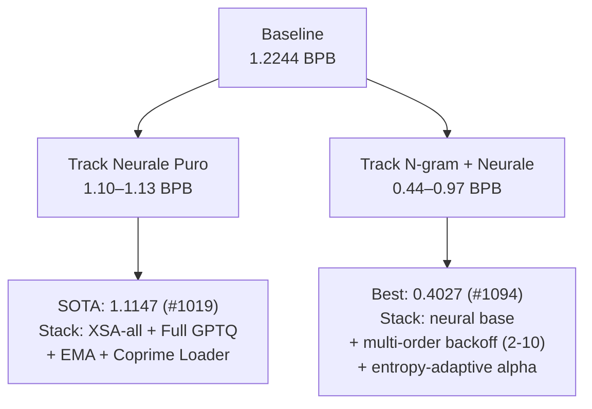
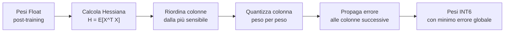

# Parameter Golf: Panorama Competitivo e Analisi Tecnica

> Analisi basata su `actual_state.md` aggiornato al 31 Marzo 2026.
> Obiettivo: capire cosa stanno facendo gli altri, dove l'architettura viene modificata,
> e dove ci sono opportunità inesplorate.

---

## Indice

1. [Stato della Competizione](#1-stato-della-competizione)
2. [L'Architettura è Quasi Sempre U-Net](#2-larchitettura-è-quasi-sempre-u-net)
3. [Categoria 1 — Quantizzazione](#3-categoria-1--quantizzazione)
4. [Categoria 2 — Eval-Time Methods](#4-categoria-2--eval-time-methods)
5. [Categoria 3 — Embedding Enrichment](#5-categoria-3--embedding-enrichment)
6. [Categoria 4 — Attention Modifications](#6-categoria-4--attention-modifications)
7. [Categoria 5 — Training Efficiency](#7-categoria-5--training-efficiency)
8. [Categoria 6 — Modifiche Strutturali alla U-Net](#8-categoria-6--modifiche-strutturali-alla-u-net)
9. [Cosa Non Funziona](#9-cosa-non-funziona)
10. [Opportunità per un Contributor Esterno](#10-opportunità-per-un-contributor-esterno)

---

## 1. Stato della Competizione

```
SOTA Ufficiale:    1.1147 BPB  (#1019, @abaybektursun — AR Self-Gen GPTQ + XSA-all)
Best Pending:      0.9485 BPB  (#1184, @icryo — Scylla tokenizer + Full GPTQ)
Baseline:          1.2244 BPB  (#0)
```

La competizione si è biforcata in due track:



> La track n-gram ha subito una purga massiva il Mar 27 (33+ PR chiuse) per un bug di
> normalizzazione: le implementazioni marcavano solo il token corretto senza normalizzare
> sul vocabolario completo. Le PR rimaste usano distribuzione full-vocab corretta.

---

## 2. L'Architettura è Quasi Sempre U-Net

**La risposta diretta**: quasi nessuno cambia l'architettura di base. Le modifiche sono *additive* — si aggiungono componenti sopra o dentro la U-Net esistente.

### Perché nessuno cambia l'architettura?

1. Il budget è 600 secondi su 8×H100. Ogni secondo speso in overhead architetturale è un secondo in meno di training.
2. La U-Net con skip connection ha dimostrato empiricamente di funzionare bene a questa scala (~17-27M parametri).
3. Architetture alternative richiedono re-tuning completo degli iperparametri — troppo costoso.

### Le eccezioni — e perché falliscono

| Architettura | BPB | Problema |
|---|---|---|
| **GEPA** (AI-discovered) | 1.098 su 4xA100 | Artifact >16MB non conforme |
| **Hymba** (Mamba SSM ibrido) | 1.1828 | Non competitivo vs 1.1147 SOTA |
| **Binary/Ternary U-Net** | 1.1239/1.1570 | Non record-eligible (hardware sbagliato) |
| **DeltaNet Crawler** | 0.882 | Alta varianza, causality concerns |
| **LLaDA-MDLM diffusion** | 1.1465 | Ancora 0.03 sopra SOTA |
| **H-Net** (byte-level) | 1.90 | Proof of concept, non competitivo |
| **Universal Transformer** | ~1.225 | Near baseline |
| **nGPT** (ipersfera) | 1.2714 | Peggio della baseline |

**Caso speciale — GEPA**: è un'architettura scoperta da un AI con Star-ReLU
(invece di ReLU²), hidden_dim=1792, e specifiche configurazioni degli skip. Funziona
(1.098 BPB) ma non rientra nel budget artifact di 16MB. Il concetto di
"ottimizzazione automatica dell'architettura" è promettente ma non ancora pratico.

---

## 3. Categoria 1 — Quantizzazione

**Perché è così importante**: il limite di 16MB costringe a usare pochissimi bit per
peso. La qualità della quantizzazione determina direttamente quanto è grande il "quant gap"
(la perdita di BPB tra modello float e modello quantizzato).

### L'evoluzione della quantizzazione in gara

```
INT8 baseline → INT6 per-riga → GPTQ-lite → Full Hessian GPTQ → mixed INT5/INT6/INT7
(~0.01 gap)     (~0.003 gap)    (~0.001 gap)  (~0.0003 gap)
```

### 3.1 INT6 vs INT8 — la base

**INT8**: 256 livelli discreti, range [-127, +127], 1 byte per peso.
**INT6**: 64 livelli discreti, range [-31, +31], 0.75 byte per peso.

```
Risparmio spazio: 17.5M param × 0.25 byte = 4.375MB → dopo zstd ≈ 3MB
Quant gap INT6: +0.003-0.004 BPB rispetto a fp32
```

La chiave è che il risparmio di spazio finanzia un modello più grande (MLP 3x, 11+ layer),
che compensa ampiamente il piccolo gap di quantizzazione.

**Quantizzazione per-riga**: ogni riga della matrice ha il suo fattore di scala float16.
Le righe di una matrice di pesi (neuroni di output) possono avere range molto diversi.
Un singolo fattore globale sarebbe troppo impreciso.

```python
# Per ogni riga i della matrice W:
abs_max_i = quantile(|W[i, :]|, 99.99%)
scale_i = abs_max_i / 31.0
W_quantized[i, :] = round(clamp(W[i, :] / scale_i, -31, 31))
```

### 3.2 GPTQ — Quantizzazione con Hessiana

**Il problema di INT6 naive**: arrotonda ogni peso indipendentemente. Se un peso
vale 2.3 e i livelli sono {..., 2.0, 2.5, ...}, si arrotonda a 2.0 o 2.5 senza
considerare l'effetto sul layer output.

**L'idea di GPTQ**: usa la *curvatura* del loss landscape (l'Hessiana del layer) per
trovare l'arrotondamento che minimizza l'errore sull'output del layer — non il singolo peso.

```
Hessiana H = sensibilità dell'output del layer rispetto a ciascun peso
Peso con H alta = critico (vicino ai valori target del layer)
Peso con H bassa = meno critico (può essere arrotondato più liberamente)

GPTQ: processa peso per peso, con compensazione dell'errore verso i pesi successivi
```

**GPTQ-lite** (#379): minimizza solo l'errore per-riga con clip percentile. Più veloce,
usato nei Tier 2-3.

**Full Hessian GPTQ** (#609, #1060): Hessiana completa con decomposizione di Cholesky +
riordinamento delle colonne (column reordering). Processa le colonne nell'ordine
dalla più sensibile alla meno sensibile. Più preciso, richiede 10-14 secondi nel
budget di training.



### 3.3 AR Self-Gen GPTQ Calibration (#1019 — SOTA attuale)

**Il problema**: GPTQ richiede dati di calibrazione — sequenze di token su cui misurare
la Hessiana. Il training set è nell'artifact (consentito), ma le sequenze del validation
set non si possono usare durante eval (regola della competizione).

**La soluzione del SOTA holder (@abaybektursun)**: far generare al modello il proprio
dataset di calibrazione. Il modello già addestrato genera 64 sequenze di 2048 token
ciascuna a temperatura 0.8 (campionamento leggermente stocastico). Queste sequenze
autogenerate sono "nel dominio" del modello (ha imparato la distribuzione del linguaggio)
ma non sono il validation set.

```python
# AR Self-Gen calibration (pseudocodice)
calibration_seqs = []
for _ in range(64):
    # Il modello genera la propria sequenza di calibrazione
    seq = model.generate(seed_token, length=2048, temperature=0.8)
    calibration_seqs.append(seq)

# Calcola Hessiana sulle sequenze autogenerate
H = compute_hessian(model, calibration_seqs)

# Quantizza con GPTQ usando questa Hessiana
model_int6 = gptq_quantize(model, H)
```

**Effetto**: chiude l'84% del gap tra calibrazione-sul-validation (ottimale, ma illegale)
e calibrazione-sul-training-set-random. Questo ha portato da 1.1142 a 1.1147 BPB.

### 3.4 Mixed Precision Quantization

Non tutti i pesi sono ugualmente sensibili alla quantizzazione. La strategia avanzata:

| Componente | Precisione | Perché |
|---|---|---|
| `tok_emb.weight` | FP16 | Lookup discreto, nessuna mediazione |
| Attention Q/K/V/proj (layer 1-8) | INT6 | Pesi grandi, tolleranti |
| Attention Q/K/V/proj (layer 9-11) | INT5 | Risparmia spazio, layer shallow |
| MLP fc/proj | INT5 o INT6 | Dipende dal budget |
| Scale, norme, skip | FP16 | Troppo piccoli da quantizzare |

**La direzione**: INT5 per MLP (hidden=1536) libera spazio per MLP 3.5x (hidden=1792)
senza superare 16MB. Esempio: #1105 usa CUTLASS EVT per rendere MLP 3.5x praticabile
nel budget temporale.

### 3.5 Compressione: da zlib a zstd a Brotli

I pesi quantizzati vengono poi compressi con un algoritmo general-purpose:

```
zlib-9:   12.5MB   ← baseline
zstd-22:  10.8MB   ← ~1.7MB gratis, standard attuale
Brotli-11 + byte-shuffle: 10.2MB  ← ~580KB aggiuntivi (#1089, #1105)
```

**Byte-shuffle**: riordina i byte prima della compressione raggruppando il bit più
significativo (MSB) di tutti i valori insieme, poi il secondo, ecc. I compressori
trovano pattern più facilmente in dati con struttura simile.

```
Dati originali:   [0xA3, 0x7F, 0x21, 0xB8, ...]  ← MSB/LSB mischiati
Dopo byte-shuffle: [0xA3, 0x21, ..., 0x7F, 0xB8, ...]  ← MSB separati da LSB
Brotli comprime molto meglio i pattern ripetuti nello stesso range
```

---

## 4. Categoria 2 — Eval-Time Methods

Questa categoria ha prodotto i salti più grandi in BPB. L'idea: invece di migliorare
solo il modello, si migliorano le procedure di scoring a parità di modello.

### 4.1 Sliding Window Evaluation (Core Five)

**Il problema del contesto tronco**: se si valuta con finestre non sovrapposte di 1024
token, i primi token di ogni finestra hanno contesto quasi zero — il modello non ha
visto nulla prima. Questo è artificialmente pessimistico perché il modello è stato
*addestrato* con contesto pieno.

**Sliding window**: finestre sovrapposte con stride=64. Ogni token viene valutato
con ~960+ token di contesto precedente.

```
Senza (baseline):
Finestra 1: [tok 0 ... tok 1023]   → tok 0 vede 0 contesto
Finestra 2: [tok 1024 ... tok 2047] → tok 1024 vede 0 contesto

Con sliding window (stride=64):
Finestra 1: [tok 0 ... tok 1023]   → loss calcolata su tok 512-1023 (contesto pieno)
Finestra 2: [tok 64 ... tok 1087]   → loss calcolata su tok 1024-1087
Finestra 3: [tok 128 ... tok 1151]  → loss calcolata su tok 1088-1151
```

**Guadagno**: -0.034 BPB. La tecnica più impattante in assoluto.

### 4.2 N-gram Eval Cache

**L'idea**: durante la valutazione con sliding window, tieni una tabella hash di frequenze
degli n-gram visti finora. Quando devi predire il prossimo token in posizione T, mescola
la predizione del modello con quella statistica degli n-gram.

```python
# Schema semplificato
cache = defaultdict(Counter)  # n-gram → distribuzione dei successori

for token_idx in range(len(val_tokens)):
    # 1. Predici con il modello
    p_model = model.predict(val_tokens[:token_idx])  # distribuzione [vocab_size]
    
    # 2. Cerca il contesto nell'n-gram cache
    context = tuple(val_tokens[token_idx-n:token_idx])  # ultimi n token
    if context in cache and sum(cache[context].values()) > threshold:
        p_ngram = normalize(cache[context])  # distribuzione empirica
        alpha = entropy_adaptive_alpha(p_model)  # usa L'incertezza del modello
        p_final = (1 - alpha) * p_model + alpha * p_ngram
    else:
        p_final = p_model
    
    # 3. Calcola loss sul token reale
    loss += -log(p_final[val_tokens[token_idx]])
    
    # 4. Aggiorna cache con il token appena visto (backward-looking)
    cache[context][val_tokens[token_idx]] += 1
```

**Multi-order backoff**: prova prima l'7-gram, poi 6-gram, 5-gram... fino al 2-gram.
La precisione aumenta con l'ordine; il backoff garantisce copertura.

**Perché funziona così bene**: il testo web ha enorme ripetizione locale — nomi, URL,
frasi idiomatiche, pattern di formattazione. Un transformer da 17M parametri non può
memorizzare tutto, ma una hash table sì.

**Guadagni osservati**:
- Fixed alpha: -0.07 a -0.09 BPB
- Multi-order backoff: -0.14 BPB
- Entropy-adaptive alpha: -0.16 BPB su base neural 1.127

**Stato**: molte implementazioni chiuse (Mar 27), ma le PR rimaste con normalizzazione
corretta (full-vocab distribution) sono valide. Vedasi #753, #795, #1094.

### 4.3 SLOT — Selective Logit Offset Tuning (#1084, #1172, #1176)

**L'idea**: invece di adattare molti parametri del modello (TTT), ottimizza un singolo
vettore delta di 512 dimensioni che viene aggiunto all'ultimo hidden state prima
della proiezione finale sul vocabolario.

```python
# Architettura SLOT
class SLOTModel(nn.Module):
    def __init__(self, base_model):
        self.base = base_model
        self.delta = nn.Parameter(torch.zeros(dim))  # 512 parametri
    
    def forward(self, x, targets):
        hidden = self.base.get_hidden(x)  # [batch, seq, 512]
        hidden_adjusted = hidden + self.delta  # aggiunge la correzione
        logits = self.base.lm_head(hidden_adjusted)
        return F.cross_entropy(logits, targets)

# Durante eval: ottimizza delta per ogni batch di token
optimizer_slot = AdamW([model.delta], lr=0.005)
for step in range(8):
    loss = model(current_batch_x, current_batch_y)
    loss.backward()
    optimizer_slot.step()
    optimizer_slot.zero_grad()
```

**Perché SLOT batte TTT sullo stack Full GPTQ**:
Il TTT aggiorna direttamente i pesi quantizzati e disturba le decisioni di arrotondamento
GPTQ ottimizzate. SLOT invece agisce solo sull'hidden state output, non sui pesi.

**Guadagni**:
- #1176: dalla sliding window 1.1155 → con TTT 1.1122 → con SLOT **1.0914** (-0.021)
- #1172: sliding window → SLOT **1.1015** senza TTT (-0.029)
- #1209: Full GPTQ + TTT + SLOT → **1.1064**

**Estensioni inesplorate**: rank-4 delta (invece di rank-1), multi-layer delta
(layers 9-11 separati), 32 step invece di 8 (quasi gratuiti perché feature cached).

### 4.4 Score-First TTT (Test-Time Training)

**L'idea di base**: prima di valutare un documento, "studia" brevemente quel documento
aggiornando i pesi su di esso. Poi esegui la valutazione con i pesi aggiornati.

**Il vincolo legale**: puoi adattarti solo su token *già valutati* (backward-looking).
Non puoi guardare i token di validazione prima di valutarli.

```
Eval con TTT score-first:
Chunk 1: [tok 0... tok 32767]
  → 1. Valuta e registra la loss per ogni token (scoring)
  → 2. Aggiorna i pesi con AdamW su questi 32768 token (training breve)
  → Pesi aggiornati per il chunk successivo

Chunk 2: [tok 32768... tok 65535]
  → Idem — usa i pesi aggiornati dal chunk 1
```

**Ricetta che funziona** (da #549, SOTA attuale):
- Ottimizzatore: AdamW (SGD peggiora di +0.065 BPB)
- LR: cosine decay, 3 epoch per chunk
- Parametri aggiornati: tutti (non solo LoRA)
- GPTQ calibrazione: deve stare DENTRO i 600 secondi di training

**Attenzione**: TTT è ridondante sullo stack Full GPTQ + XSA-all (vedi #1019 e #1060
che battono SOTA senza TTT). Full GPTQ probabilmente cattura già quello che TTT forniva.

---

## 5. Categoria 3 — Embedding Enrichment

### 5.1 SmearGate + BigramHash + OrthoInit (Stack quasi universale)

Queste tre tecniche vanno SEMPRE insieme — sono co-dipendenti.

**SmearGate**: gate apprendibile che mescola l'embedding del token corrente con quello
del token precedente. Il modello impara quali dimensioni "guardano avanti" (gate≈1)
e quali "guardano indietro" (gate≈0).

```python
# SmearGate forward
g = sigmoid(W_gate @ embedding(token_T))  # gate [dim] ∈ [0,1]
output = g * embedding(token_T) + (1 - g) * embedding(token_{T-1})
```

**BigramHash**: hash table apprendibile di dimensione [n_buckets, dim]. Per ogni
coppia di token consecutivi (T-1, T), esegui un lookup e aggiungi il vettore
all'embedding.

```python
bucket = hash(token_{T-1}, token_T) % n_buckets  # es. 2816-4096 bucket
output = embedding(token_T) + bigram_table[bucket]
```

**OrthoInit**: inizializzazione ortogonale di tutti i pesi invece della gaussiana
standard. I neuroni partono indipendenti. SmearGate senza OrthoInit *peggiora*
il BPB di 0.003 (ablazione #212).

**Intuizione del sistema**: il transformer deve scoprire le relazioni bigram via
attention (costoso in parametri e compute). SmearGate+BigramHash iniettano questa
informazione gratis nell'embedding layer, liberando la capacità del transformer
per pattern più complessi.

### 5.2 EngramLite (#1089, usato nel 1.1086)

Versione avanzata di BigramHash con:
- **Multi-head**: K=2 teste × (bigram + trigram) = 4 lookup separati
- **Prime-based hashing**: modulo numero primo per ridurre collisioni
- **8192 bucket** invece dei 2048-4096 standard

```python
class EngramLite(nn.Module):
    def __init__(self, n_heads=2, n_buckets=8192, dim=512):
        self.bigram_tables = nn.Embedding(n_heads * n_buckets, dim // n_heads)
        self.trigram_tables = nn.Embedding(n_heads * n_buckets, dim // n_heads)
    
    def forward(self, input_ids):
        # Bigram lookup (con 2 head separate → meno collisioni)
        h1 = hash_prime(t_{T-1}, t_T) % n_buckets
        h2 = hash_prime(t_{T-1} * P1 + t_T, t_T) % n_buckets  # diverso seme
        bigram_vec = concat(table1[h1], table2[h2])
        
        # Trigram lookup
        h3 = hash_prime(t_{T-2}, t_{T-1}, t_T) % n_buckets
        h4 = hash_prime(...)
        trigram_vec = concat(table3[h3], table4[h4])
        
        return bigram_vec + trigram_vec
```

### 5.3 Scylla Tokenizer (#1143 — il più grande singolo guadagno della gara)

**La rivoluzione del tokenizer**: la tecnica con il maggiore impatto singolo in tutta
la competizione. @simon-marcus ha guadagnato -0.028 BPB rispetto al best precedente
semplicemente cambiando il tokenizer.

**TokenMonster vs BPE**:
- BPE (Byte Pair Encoding): greedy merging delle coppie più frequenti. Subottimale
  per definizione — sceglie sempre il merge localmente ottimale.
- TokenMonster: ricerca multi-branch (6 rami paralleli per posizione). Trova
  vocabolari che producono ~37.5% meno token a parità di vocab size.

**Scylla specificamente**:
- Parte da `english-1024-clean-v1` (tokenizer SentencePiece standard)
- Pruning a 998 token tramite autoresearch in 3 fasi (SP search → TM sidecar → TM-only)
- 998 token invece di 1024: l'embedding è leggermente più piccolo
- BPB misurato via LUT (lookup table) esplicita per ogni token, non via SentencePiece runtime

**Perché conta al livello della competizione**:
```
Con vocab 1024: embedding = 1024 × 512 = 524K param × 2 byte (fp16) = 1MB
Con vocab 998:  embedding =  998 × 512 = 511K param × 2 byte (fp16) = 0.98MB
                                         → risparmia 20KB (spazio fisico irrilevante)
                                         → ma il tokenizer che selezioniamo
                                            impatta direttamente quanti token/byte
                                            il modello deve predire
```

Il BPB è calcolato come `bits_per_token × tokens_per_byte`. Un tokenizer migliore
riduce `tokens_per_byte` (sequenze più corte) E migliora la predizione perché i token
sono più informativi e coerenti semanticamente.

**Adozione**: #1184 (@icryo) ha combinato Scylla con lo stack #1060 → **0.9485 BPB**,
il primo sotto 1.0 validato.

---

## 6. Categoria 4 — Attention Modifications

### 6.1 XSA — Exclusive Self-Attention (#265)

**Il problema dell'auto-attenzione**: nell'attention standard, il valore di ogni token
include un contributo dal token stesso (self-value). Questo crea un "bias verso di sé"
— i layer di attention tendono a copiare informazioni piuttosto che trasformarle.

**XSA**: sottrae il contributo del self-value dall'output dell'attention.

```python
# Attention standard:
# A = softmax(QK^T/sqrt(d))
# output = A @ V  ← include A[i,i] * V[i] (il contributo del token a se stesso)

# XSA:
# output_xsa = output - diag(A) * V  ← rimuove il contributo self
```

Con GQA (Grouped Query Attention come nel baselin), l'implementazione è leggermente
più complessa perché Q e K/V heads non corrispondono 1:1, ma il principio è lo stesso.

**Configurazione ottimale**:
- XSA sui **tutti gli 11 layer** al frontier (XSA-4 era ottimale in Tier 2-3, ma
  al frontier con Full GPTQ l'overhead dei 3 layer extra è ammortizzato)
- Overhead: +2ms/step → ~-160 step in 600s. Vale la pena.
- Zero parametri aggiuntivi.

**Risultati**:
```
Baseline:        1.2244 BPB
+XSA-4 layers:  ~1.1270 BPB  (-0.010)
+XSA-all 11:    ~1.1210 BPB  (-0.006 aggiuntivi)
```

### 6.2 Partial RoPE (#315)

**RoPE standard**: applica la codifica posizionale rotatoria a *tutte* le dimensioni
di query e key. Ogni dimensione "sa" quanto è lontana dal token corrente.

**Partial RoPE**: applica RoPE solo al 25% delle dimensioni (16 su 64 per head).
Le altre 48 dimensioni sono *position-free* — vedono la similarità semantica pura
indipendentemente dalla posizione.

```python
# RoPE standard: tutti 64 dim ricevono la rotazione
q_rotated = apply_rope(q, cos, sin)  # ruota tutto

# Partial RoPE (16/64):
q_rope_dims = q[..., :16]   # prime 16 dim: con posizione
q_free_dims = q[..., 16:]   # ultime 48 dim: senza posizione

q_rotated = cat([
    apply_rope(q_rope_dims, cos[:16], sin[:16]),
    q_free_dims  # passthrough invariato
], dim=-1)
```

**Perché funziona**: le 48 dimensioni libere imparano similarità semantica
*indipendente dalla posizione*. Due occorrenze della parola "gatto" in posizioni
distanti avranno alta similarità nelle dimensioni libere, anche se la distanza
posizionale riduce la similarità nelle dimensioni RoPE.

**Guadagno**: -0.001 a -0.002 BPB. Zero parametri.

### 6.3 QK-Gain — Temperatura per-head apprendibile (#259, trovato ottimale in #1125)

**Il problema della temperatura dell'attention**: la sharpness dell'attention (quanto
concentrata vs distribuita) influenza le performance. Il valore standard è 1/sqrt(d_head),
fisso per tutti i head.

**QK-Gain**: aggiunge uno scalare *apprendibile per ogni Q head* dopo il QK-Norm:

```python
class CausalSelfAttention(nn.Module):
    def __init__(self, ...):
        self.q_gain = nn.Parameter(torch.ones(num_heads))  # init=1.0
    
    def forward(self, x):
        q = self.q_proj(x)  # [batch, seq, n_heads, head_dim]
        q = rms_norm(q)  # QK-Norm
        q = q * self.q_gain[head_idx]  # <- moltiplica per il gain apprendibile
        # ...
```

**Il valore ottimale è 4.0** (trovato da @jainpranjal97 con 45 esperimenti in #1125).
Un gain più alto rende l'attention più sharp (ogni head si concentra su meno token),
effettivamente aumentando la "precisione" dell'attention.

**Guadagno**: -0.003 a -0.006 BPB (confermato 3-seed).
**Overhead**: ~8 scalari per head × 8 head = 64 parametri totali. Trascurabile.

### 6.4 QK-Norm (QK normalizzazione)

**Il problema**: durante il training con Muon a LR aggressive, i logit Q⋅K^T possono
esplodere, rendendo l'attention degenere (un singolo token cattura tutta l'attenzione).

**La patch attuale**: softcapping dei logit con `tanh(x/30)*30`.

**QK-Norm** (alternativa più elegante): L2-normalizza Q e K prima del dot product,
aggiungendo un fattore di temperatura apprendibile per-head.

```python
q = F.normalize(q, dim=-1) * q_scale  # unit norm + temperatura apprendibile
k = F.normalize(k, dim=-1)             # unit norm fisso
# logit = q @ k.T → bounded in [-1, 1] prima del temperaggio
```

**Perché è meglio del softcapping**: il softcapping è reattivo (clipa i valori
esplosi); QK-Norm è preventivo (impedisce l'esplosione). Elimina anche i "Q condition
numbers" da 100M+ identificati in #215.

**Non ancora adottato universalmente** — è nella lista "untried" ad alto valore.

---

## 7. Categoria 5 — Training Efficiency

### 7.1 Coprime-Stride Loader (#726)

**Il problema del data loader standard**: il dataset FineWeb è diviso in ~80 shard
binari. Il loader baseline legge i shard sequenzialmente. Con 8 GPU, ogni GPU
legge shard consecutivi → i batch hanno poca diversità (tutti dal stesso shard).

**Coprime-Stride**: campiona i shard con uno stride che è coprimo con il numero
totale di shard. "Coprimo" significa che `gcd(stride, n_shard) = 1`.

```python
# Esempio: 80 shard, stride=7 (coprimo con 80 perché gcd(7,80)=1)
# GPU 0 legge: shard [0, 7, 14, 21, 28, 35, 42, 49, 56, 63, 70, 77, 4, 11, ...]
# GPU 1 legge: shard [1, 8, 15, 22, ...]
# → Ogni batch mescola documenticon shard distanti → maggiore diversità

# Se stride non fosse coprimo (es. stride=10, gcd(10,80)=10):
# GPU 0 leggerebbe: shard [0, 10, 20, 30, 40, 50, 60, 70, 0, 10, ...]  ← si ripete dopo 8 shard
```

La proprietà matematica: con stride coprimo, il loader attraversa tutti gli 80
shard prima di ripetere un singolo token. È un ciclo completo di permutazione.

**Guadagno**: -0.012 BPB. Zero overhead computazionale (solo logica del data loader).
Adottato da #1060 (SOTA-beating), #1089, #1099, #1135.

### 7.2 Parallel Muon (#399)

**Il problema di Muon distribuito**: la Newton-Schulz orthogonalization richiede
che ogni GPU abbia il gradiente completo della sua matrice prima di procedere.
Con DDP (Distributed Data Parallel), i gradienti vengono sincronizzati con
all-reduce tra tutte le GPU.

**Parallel Muon**: ottimizza l'all-reduce per sovrapporre comunicazione e calcolo.
Mentre una GPU aggiorna i pesi con i gradienti già disponibili, comunica
in background i gradienti per le matrici successive.

**Guadagno**: -3.1% tempo/step = +227 step nel budget di 600s. Puramente sistemistico,
zero impatto sulla qualità per step — ma più step = più training = BPB migliore.

### 7.3 Fused Triton MLP Kernel (#1072, #1089)

**Il problema**: ogni operazione PyTorch standard lancia un kernel CUDA separato.
Il forward del MLP esegue:
1. Linear (matrix multiplication) — kernel 1
2. LeakyReLU — kernel 2
3. Square — kernel 3
4. Linear (matrix multiplication) — kernel 4

Ogni kernel implica: lettura da HBM (High Bandwidth Memory), calcolo, scrittura su HBM.
Le operazioni elementwise (LeakyReLU, square) usano poca compute e molti accessi memoria.

**Fused kernel**: combina le operazioni 1-3 in un singolo kernel Triton che mantiene
gli intermedi nei registri CUDA (non tocca HBM). Elimina 2 round-trip verso HBM
per ogni forward dell'MLP.

```
Standard:  Linear → [HBM read/write] → LeakyReLU → [HBM read/write] → Square
Fused:     Linear → [REG] → LeakyReLU → [REG] → Square → [HBM write una volta]
```

**Guadagno**: 87ms/step → 70ms/step = **+33% step** nel budget. Con 33% più step,
il modello vede significativamente più token → BPB migliore.

### 7.4 CUTLASS EVT Backward Fusion (#1105)

Versione ancora più aggressiva: fonde anche il backward pass del MLP usando
CUTLASS (CUDA Templates for Linear Algebra Subroutines) con Epilogue Visitor Tree.

**L'Epilogue Visitor Tree**: permette di definire operazioni custom nell'epilogo di
una GEMM (General Matrix Multiply) senza uscire dal kernel. Invece di:

```
GEMM(grad_out, W_down^T) → [HBM] → * activation_grad → [HBM]
```

Si fa:
```
GEMM(grad_out, W_down^T) → [REG] → * activation_grad → [HBM] # tutto in un kernel
```

**Guadagno**: -3.7% tempo/step = +500 step. Specifico per Hopper (H100).

---

## 8. Categoria 6 — Modifiche Strutturali alla U-Net

Queste tecniche cambiano la struttura interna della U-Net mantenendo il paradigma generale.

### 8.1 Depth Recurrence (#686 — caso di successo)

**L'idea**: invece di avere K layer indipendenti, fai passare il tensore attraverso
gli stessi layer più volte. È come avere più layer virtuali condividendo i pesi.

**Perché la maggior parte dei tentativi fallisce**:
- **3+ cicli**: l'errore di quantizzazione si amplifica 900× attraverso i cicli.
  Ogni ciclo ri-introduce il rumore INT6, e dopo 3 cicli il segnale è completamente
  corrotto.
- **Costo computazionale**: 2× più lento → meno step → meno token visti.

**Il caso di successo (#686, @msisovic)**: ripete *solo i layer 4 e 5*, una sola volta.
11L → 13L virtuali. Con scalari per-passo apprendibili che pesano il contributo
di ogni passata.

```python
# Depth recurrence "shallow" (solo 2 layer, 1 ciclo):
x = block[4](x, x0)   # prima passata
x = block[5](x, x0)   # prima passata

# Secondo ciclo (stessi pesi, scalate per evitare amplificazione):
x = block_scale_a * block[4](x, x0) + x  # residuale pesato
x = block_scale_b * block[5](x, x0) + x  # residuale pesato
```

**Risultato**: 1.1182 BPB (3-seed). Recupera ~70% del guadagno di un vero 13L
a minimo costo computazionale.

### 8.2 Parallel Residuals — Dual-Lane Routing (#1204)

**L'idea (da modded-nanogpt #230)**: invece del residuale classico
`x = x + attention(x) + mlp(x)`, crei due "corsie" separate che scorrono in
parallelo dalla metà della rete in poi.

```
Layer 0-6 (standard):
  x → attention → + → mlp → + → x_next

Layer 7-10 (parallel residuals):
  x_attn → attention → result_attn
  x_mlp  →   mlp    → result_mlp    # partono da stati separati
  
  x_next_attn = x_attn + result_attn
  x_next_mlp  = x_mlp  + result_mlp
  
  # Cross-lane routing: le due corsie si scambiano informazioni
  x_final = cross_route(x_next_attn, x_next_mlp)  # routing apprendibile
```

**Intuizione**: attention e MLP catturano tipi diversi di informazione (contestuale
vs fattuale). Permettere loro di svilupparsi in parallelo senza interferirsi potrebbe
preservare meglio entrambi i tipi di rappresentazione.

**Status**: 1.1063 BPB (3-seed) — non ancora validato statisticamente. Promettente
ma non confermato.

### 8.3 ResidLambdas (#1130)

**L'idea**: aggiunge scalari apprendibili per-sublayer sul path residuale.
Invece di `x = x + f(x)`, usa `x = x + lambda * f(x)`.

```python
class Block(nn.Module):
    def __init__(self, ...):
        # Lambda per attention e MLP, inizializzati a sqrt(1.1) per stabilità
        self.attn_lambda = nn.Parameter(torch.tensor(math.sqrt(1.1)))
        self.mlp_lambda = nn.Parameter(torch.tensor(math.sqrt(1.1)))
    
    def forward(self, x, x0):
        x = x + self.attn_lambda * self.attn(self.attn_norm(x))
        x = x + self.mlp_lambda * self.mlp(self.mlp_norm(x))
        return x
```

Il learning rate per questi scalari è 5× rispetto agli altri parametri (si aggiustano
rapidamente). L'init a `sqrt(1.1)` invece di `1.0` è empiricamente più stabile.

**Risultato**: 1.1140 BPB (12-seed! Validazione molto rigorosa). 
Ora downgraded perché SOTA si è spostato a 1.1147, ma la tecnica è valida.

### 8.4 Sigmoid-Gated Skip Connections (#1089, #1172)

**L'idea**: i path skip della U-Net (dall'encoder al decoder) hanno peso fisso
o apprendibile lineare. Aggiungere un gate sigmoid per controllare dinamicamente
*quanto* informazione dell'encoder passa al decoder corrispondente.

```python
# Skip connection standard:
x = x + skip_weight * skips.pop()

# Sigmoid-gated skip:
gate = sigmoid(self.skip_gate)  # gate ∈ (0, 1), ~5 parametri totali
x = x + skip_weight * gate * skips.pop()
```

**Intuizione**: non tutte le informazioni di ogni layer encoder sono ugualmente
utili per il layer decoder corrispondente. Il gate impara a selezionare.

**Status**: adottato da #1089 e #1172. Guadagno stimato -0.001 a -0.002 BPB.

### 8.5 Window Attention (Training-Time) (#1212)

**L'idea**: invece di full attention durante training, usa attention a finestra
limitata (512 token) nei layer pari. I layer dispari mantengono full attention.

```
Training con seq_len=6144:
Layer 0 (full):    ogni token attende a tutti i 6144 token precedenti
Layer 1 (window):  ogni token attende solo ai 512 più recenti
Layer 2 (full):    full attention
Layer 3 (window):  window 512
...
```

**Perché**: con seq_len=6144 (per catturare contesto lungo), il costo dell'attention
è O(6144²) — molto costoso. Window attention su layer alternati riduce il costo del
~21% mantenendo la capacità di catturare pattern sia locali che globali.

**Status**: 1.1108 BPB (5-seed, però non ancora record-eligible). Interessante come
tecnica per aumentare il seq_len di training.

---

## 9. Cosa Non Funziona

Evitare questi cul-de-sac risparmia settimane di lavoro:

| Tecnica | Risultato | Perché |
|---|---|---|
| **MoE a questa scala** | -0.06 a -0.08 BPB vs denso | Scaling laws: sparsità ottimale = 0 sotto ~500M param |
| **SwiGLU** | Peggio di ReLU² | Su questa arch specifica (GEPA usa Star-ReLU non SwiGLU) |
| **Recurrence 3+ cicli** | Quant error esplode 900× | INT6 amplifica l'errore per ogni ciclo |
| **Knowledge Distillation** | +0.003 a +0.407 BPB | I/O overhead distrugge i token/step |
| **INT4** | +0.065 BPB | Il divario quadrupla rispetto a INT6 |
| **2:4 Structured Sparsity** | +0.672 BPB | Definitivamente morto a questa scala |
| **Turbo-Muon su 8×H100** | +0.0018 BPB peggio | Vantaggio a step 500 svanisce a 7000+ step |
| **Sliding window logit averaging** | +0.024 BPB | Distrugge le predizioni sharp |
| **MC Dropout ensemble** | +0.002 a +0.005 BPB | Sub-network troppo simili a 17M param |
| **SGD per TTT** | +0.065 BPB vs AdamW | Usa AdamW per TTT |
| **Step-based LR schedule** | -0.483 BPB | Il budget varia per hardware, usa wallclock |
| **LR Warmup >500 step** | Marginale o negativo | Momentum warmup copre già questa funzione |
| **SmearGate senza OrthoInit** | +0.003 BPB | Co-dipendenti, vanno sempre insieme |
| **EMA senza XSA** | Peggiora vs SWA | Richiede XSA come prerequisito |

---

## 10. Opportunità per un Contributor Esterno

Basandosi sull'analisi, queste sono le nicchie meno affollate con il miglior
rapporto sforzo/impatto per qualcuno che parte ora:

### Opportunità 1: Stack Tier 2 Pulito (più sicura, 3-4 settimane)

Implementare il stack competitivo completo con ablazioni rigorose:

```
INT6 → MLP 3x → Sliding Window → FP16 Embed → Zstd-22
+ OrthoInit + SmearGate + BigramHash + 11L + EMA + WD=0.04
+ XSA-all + Partial RoPE + QK-Gain=4.0 + Full GPTQ (AR self-gen)
```

Target: ~1.12-1.13 BPB. **Valore**: PR solida, riproducibile, base per successive PR.

### Opportunità 2: QK-Norm + QK-Gain combinati (1-2 settimane)

QK-Norm è completamente inesplorato in gara. Potrebbe rimpiazzare sia il softcapping
che il LN Scale, riducendo il condition number dei Q da 100M+ a ~1.
Con QK-Gain=4.0 sopra potrebbe scalare meglio.

**Experiment design**:
1. Sostituisci softcapping con QK-Norm
2. Testa con e senza QK-Gain=4.0
3. Testa con Partial RoPE (l'interazione potrebbe essere positiva)

### Opportunità 3: CPSVD — Column-Preserving SVD (2-3 settimane, alta varianza)

Completamente inesplorato in gara. L'idea: invece di quantizzare tutti i pesi a INT6,
identifica le colonne delle matrici di peso che hanno "rango intrinseco basso" e
fattorizzale come prodotto A×B (rank-r). Le altre colonne rimangono in INT6.

```python
W = [out, in]
# Le colonne con singular decay rapido:
U, S, Vt = torch.linalg.svd(W[:, good_cols])
rank = argmax(cumsum(S**2) > 0.995 * sum(S**2))  # 99.5% della varianza
A = U[:, :rank] * S[:rank]   # [out, rank]
B = Vt[:rank, :]              # [rank, n_good_cols]
# A@B ha meno bit di W[:, good_cols] se rank << n_good_cols

# Le colonne "difficili" rimangono in INT6 standard
W_compressed = {
    'low_rank_cols': (A, B),  # fattorizzate
    'hard_cols': W[:, hard_cols_int6]  # INT6 standard
}
```

**Rischio principale** (da #1048): le matrici di rotazione (U, V) possono essere ad
alta entropia → zstd non le comprime bene → artifact più grande, non più piccolo.
Soluzione: quantizzare A e B a INT6 prima di comprimere e misurare il file finale,
*non* l'RMSE.

### Opportunità 4: ResidLambdas affinato (1 settimana)

#1130 ha già dimostrato che funziona (12-seed, Δ=0.0091 nats). Ora è downgraded
perché SOTA si è spostato. Combinarlo con lo stack #1019 (Full GPTQ + XSA-all
+ AR self-gen) non è stato tentato. Se le due tecniche si sommano, potrebbe
battere il SOTA con una PR relativamente semplice.

### Tabella Riassuntiva

| Opportunità | Difficoltà | Tempo stimato | EV medio | Inesplorato? |
|---|---|---|---|---|
| Stack Tier 2 pulito | ⭐ | 3-4 sett | PR ~1.13 | No, ma solido |
| QK-Norm + QK-Gain | ⭐⭐ | 1-2 sett | -0.002 a -0.005 | ✅ Sì |
| CPSVD | ⭐⭐⭐ | 2-3 sett | -0.003 a -0.008 | ✅ Sì |
| ResidLambdas + #1019 | ⭐⭐ | 1 sett | Potenzialmente record | Combinazione nuova |
| Window Attention potenziato | ⭐⭐ | 2 sett | Incerto | Validazione in corso |

---

*Documento generato il 2026-04-01 — Basato su `actual_state.md` (Mar 31, 11:03 PM PT)*
