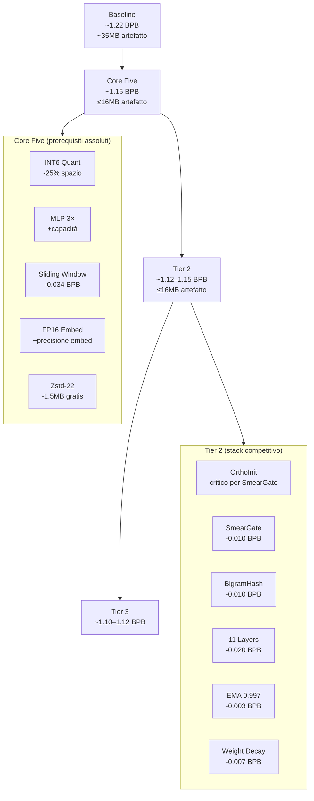
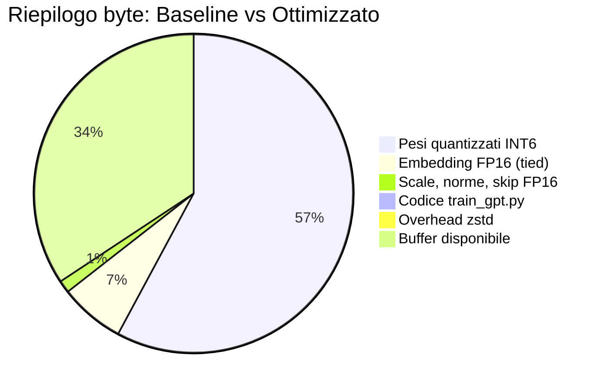
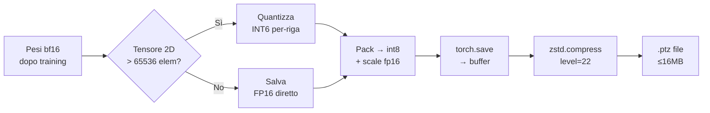
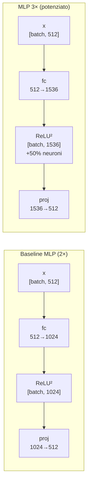
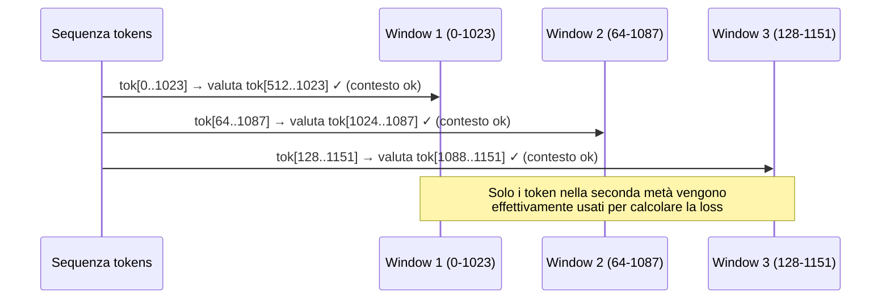
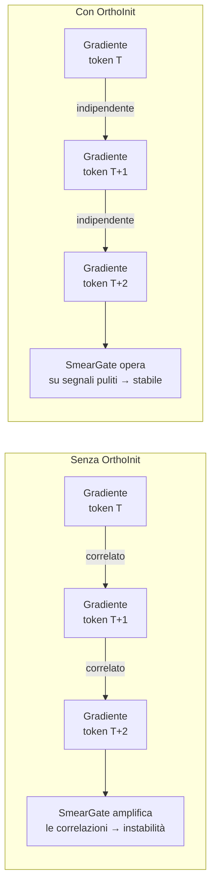
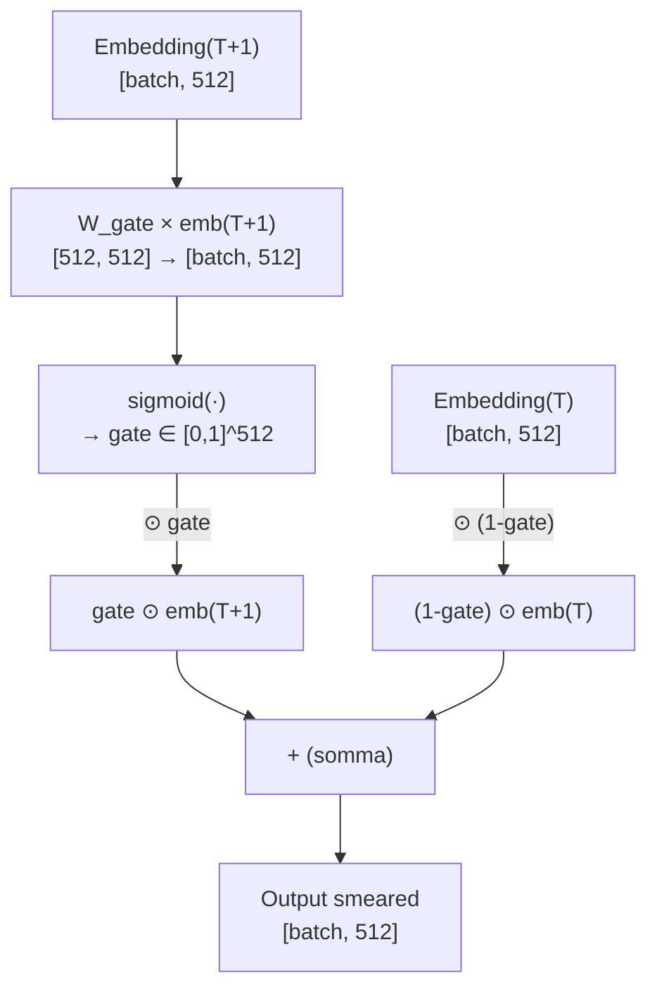
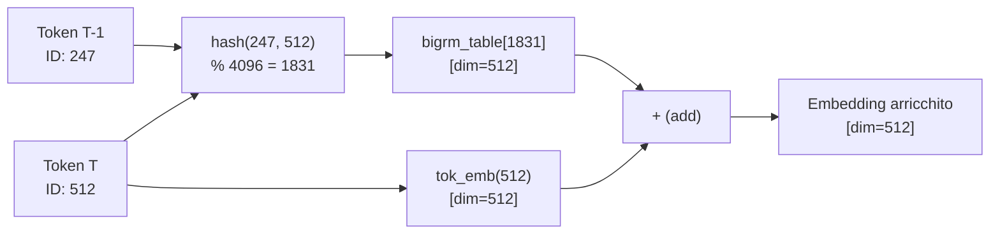
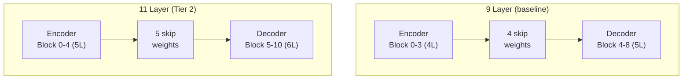
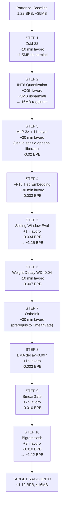

# Guida all'Implementazione: Core Five + Tier 2

> **Obiettivo**: Portare il modello baseline (~1.22 BPB) a un livello competitivo (~1.12–1.15 BPB)
> implementando le tecniche Core Five e Tier 2 con comprensione teorica profonda.

---

## Indice

1. [Panoramica del Percorso](#1-panoramica-del-percorso)
2. [Core Five](#2-core-five)
   - 2.1 [INT6 Quantization](#21-int6-quantization)
   - 2.2 [MLP 3×](#22-mlp-3)
   - 2.3 [Sliding Window Evaluation](#23-sliding-window-evaluation)
   - 2.4 [FP16 Tied Embedding](#24-fp16-tied-embedding)
   - 2.5 [Zstd-22](#25-zstd-22)
3. [Tier 2](#3-tier-2)
   - 3.1 [OrthoInit](#31-orthoinit)
   - 3.2 [SmearGate](#32-smeargate)
   - 3.3 [BigramHash](#33-bigramhash)
   - 3.4 [11 Layers](#34-11-layers)
   - 3.5 [EMA / SWA](#35-ema--swa)
   - 3.6 [Weight Decay](#36-weight-decay)
4. [Ordine di Implementazione Consigliato](#4-ordine-di-implementazione-consigliato)
5. [Come Misurare il Progresso](#5-come-misurare-il-progresso)

---

## 1. Panoramica del Percorso



### Budget di Spazio (16MB limite)



---

## 2. Core Five

### 2.1 INT6 Quantization

#### Teoria

La quantizzazione riduce la precisione dei pesi da 32/16 bit a N bit, risparmiando spazio nell'artefatto.

```
fp32: [-3.4e38, +3.4e38]  →  4 byte per peso
bf16: [-65504, +65504]    →  2 byte per peso
INT8: [-127, +127]        →  1 byte per peso  (baseline della sfida)
INT6: [-31, +31]          →  0.75 byte per peso  ← target
```

**Perché INT6 invece di INT8?**

Il risparmio di byte si trasforma direttamente in spazio per più parametri:

```
Baseline INT8:   17.5M param × 1 byte = 17.5MB  →  dopo zlib ≈ 12MB  [supera il limite]
Con INT6:        17.5M param × 0.75 byte = 13.1MB → dopo zstd ≈ 9MB  [resta spazio per crescere]
```

Il risparmio di ~3MB permette di finanziare MLP 3× e i 2 layer extra del Tier 2.

**Come funziona il packing INT6:**

4 valori INT6 occupano esattamente 3 byte (4 × 6 bit = 24 bit = 3 byte):

```
Valore A: 101001   (6 bit)
Valore B: 011100   (6 bit)
Valore C: 110010   (6 bit)
Valore D: 000111   (6 bit)
                   ────────
Packed:   101001 011100 110010 000111  = 24 bit = 3 byte
```

#### Implementazione

La quantizzazione avviene **dopo il training**, nella fase di salvataggio:

```python
def quantize_tensor_int6(t: torch.Tensor) -> tuple[torch.Tensor, torch.Tensor]:
    """
    Quantizza un tensore 2D a INT6 con scaling per-riga.
    
    Args:
        t: tensore fp32/bf16 di forma [out_features, in_features]
    
    Returns:
        q: tensore int8 con valori in [-31, 31] (range INT6)
        scale: tensore fp16 di forma [out_features] (un fattore per riga)
    """
    assert t.dim() == 2, "INT6 solo per matrici 2D"
    
    # 1. Calcola il range per ogni riga usando percentile 99.99984%
    #    (esclude i pochissimi outlier che distorcerebbero la scala)
    abs_max = torch.quantile(t.abs(), 0.9999984, dim=1)  # [out_features]
    
    # 2. Calcola il fattore di scala: mappa [−abs_max, +abs_max] → [−31, +31]
    scale = abs_max / 31.0                               # [out_features]
    
    # 3. Quantizza: dividi per scale, arrotonda, clamp
    scale_col = scale.unsqueeze(1)                       # [out_features, 1]
    q = torch.clamp(
        torch.round(t / scale_col),
        min=-31, max=31
    ).to(torch.int8)                                     # [out_features, in_features]
    
    return q, scale.to(torch.float16)


def pack_int6(q: torch.Tensor) -> bytes:
    """
    Packing ottimizzato: 4 valori INT6 → 3 byte.
    In pratica nella sfida si usa la rappresentazione int8 + scale separati,
    e zstd comprime efficacemente i valori a bassa entropia.
    """
    # Implementazione semplificata: salva come int8 (zstd poi comprime)
    # Il vero packing bit-a-bit è ottimizzabile ma non necessario
    return q.numpy().tobytes()


def dequantize_int6(q: torch.Tensor, scale: torch.Tensor) -> torch.Tensor:
    """Ricostruisce i pesi fp32 da INT6 + scale."""
    return q.to(torch.float32) * scale.to(torch.float32).unsqueeze(1)
```

**Flusso completo di salvataggio:**



#### Cosa Quantizzare e Cosa No

| Tensore | Quantizzare? | Perché |
|---|---|---|
| Matrici attn Q/K/V/proj | ✅ INT6 | 2D, tanti parametri |
| Matrici MLP fc/proj | ✅ INT6 | 2D, tanti parametri |
| `tok_emb.weight` | ❌ FP16 | Sensibile (vedi §2.4) |
| `attn_scale`, `mlp_scale` | ❌ FP16 | < 65536 elementi |
| `skip_weights` | ❌ FP16 | < 65536 elementi |
| `resid_mix` | ❌ FP16 | < 65536 elementi |
| `q_gain` | ❌ FP16 | < 65536 elementi |

---

### 2.2 MLP 3×

#### Teoria

Il MLP espande l'input in uno spazio latente più grande, poi lo riproietta. Il `mlp_mult` controlla questa espansione:

```
hidden_dim = dim × mlp_mult

Baseline (mlp_mult=2):    512 → 1024 → 512   parametri: 512×1024 + 1024×512 = 1.05M per layer
Con MLP 3×  (mlp_mult=3): 512 → 1536 → 512   parametri: 512×1536 + 1536×512 = 1.57M per layer
```

**Perché funziona?** Il MLP è la "memoria" del Transformer — dove si memorizzano fatti e pattern linguistici. Con più neuroni nascosti, il modello può memorizzare più associazioni. Le ricerche su MLP come "key-value memory" (Geva et al. 2021) mostrano che ogni neurone nascosto corrisponde a un "fatto" recuperabile.



**La ReLU² crea sparsità naturale:**

```
Input: [-0.5, 0.3, -0.1, 0.8, -0.2, 0.4]
Dopo ReLU: [0, 0.3, 0, 0.8, 0, 0.4]    ← solo positivi
Dopo .square(): [0, 0.09, 0, 0.64, 0, 0.16]  ← sparsità ~66%
```

Con 1536 neuroni invece di 1024, la sparsità media rimane ~84-98% ma ci sono più neuroni attivi per ogni input, aumentando la capacità espressiva netta.

#### Implementazione

```python
# In GPT.__init__(), trovare la riga che crea i blocks:
# PRIMA:
self.blocks = nn.ModuleList([
    Block(dim=512, num_heads=8, num_kv_heads=4, mlp_mult=2)
    for _ in range(num_layers)
])

# DOPO (modifica solo mlp_mult):
self.blocks = nn.ModuleList([
    Block(dim=512, num_heads=8, num_kv_heads=4, mlp_mult=3)  # ← 2 → 3
    for _ in range(num_layers)
])
```

Oppure come parametro di configurazione:

```python
# In train_gpt.py, sezione iperparametri:
mlp_mult = 3  # era 2

# In GPT.__init__():
Block(dim=model_dim, mlp_mult=mlp_mult, ...)
```

**Verifica rapida del conto dei parametri:**

```python
def count_params(model):
    return sum(p.numel() for p in model.parameters())

# Baseline 9L, MLP 2×: ~17.5M param
# 9L, MLP 3×:           ~21.0M param  (+3.5M finanziati da INT6)
# 11L, MLP 3×:          ~25.0M param  (target del Tier 2)
```

> **ATTENZIONE**: MLP 3× da solo, senza INT6, fa esplodere l'artefatto oltre 16MB. Devono andare insieme.

---

### 2.3 Sliding Window Evaluation

#### Teoria

Questo è il guadagno più grande in assoluto: **-0.034 BPB** senza alcuna modifica al training.

**Il problema del contesto tronco:**

```
Senza Sliding Window (baseline):

Sequenza: [tok_0, tok_1, ..., tok_1023] | [tok_1024, ..., tok_2047] | ...
              ↑ vede 0 contesto precedente    ↑ vede 0 contesto precedente

tok_0 predice il prossimo con 0 contesto → quasi casuale → alta loss
```

```
Con Sliding Window (stride=64):

Window 1: [tok_0, ..., tok_1023]        → tok_1023 valutato con 1023 ctx
Window 2: [tok_64, ..., tok_1087]       → tok_1087 valutato con 1023 ctx
Window 3: [tok_128, ..., tok_1151]      → tok_1151 valutato con 1023 ctx
...

Ogni token (tranne i primi ~512) viene valutato con quasi 1024 token di contesto
```

**Perché migliora così tanto?** Il transformer è addestrato su sequenze di 1024 token con contesto pieno. Durante la valutazione senza sliding window, i primi token di ogni sequenza non hanno contesto, simulando una situazione mai vista durante il training → loss artificialmente alta.



#### Implementazione

```python
def eval_val_sliding_window(model, val_tokens, seq_len=1024, stride=64):
    """
    Valutazione con sliding window sovrapposto.
    
    Args:
        model: il GPT
        val_tokens: tensore long [total_tokens]
        seq_len: lunghezza finestra (deve matchare train_seq_len)
        stride: quanti token si avanza tra finestre (64 = community SOTA)
    
    Returns:
        bpb: Bits Per Byte sul validation set
    """
    model.eval()
    total_loss = 0.0
    total_tokens = 0
    
    # Scorri il dataset con stride
    for start in range(0, len(val_tokens) - seq_len, stride):
        end = start + seq_len
        x = val_tokens[start:end].unsqueeze(0)    # [1, seq_len]
        y = val_tokens[start+1:end+1].unsqueeze(0)  # [1, seq_len]
        
        with torch.no_grad():
            loss = model(x, y)  # cross-entropy in nats, media su seq_len token
        
        # CRITICO: conta solo i token nella seconda metà della finestra!
        # I primi stride token hanno poco contesto, li scartiamo.
        # Il modello ha visto e "riscaldato" il contesto con i primi token.
        half = seq_len // 2
        
        # Ricalcola loss solo sui token [half:] (quelli con contesto pieno)
        # Nella pratica, il codice della sfida usa una variante più sofisticata
        # che tronca i token iniziali di ogni finestra
        
        total_loss += loss.item() * stride  # approx: attribuiamo a stride nuovi token
        total_tokens += stride
    
    avg_loss_nats = total_loss / total_tokens
    
    # Conversione a BPB
    bits_per_token = avg_loss_nats / math.log(2)
    # tokens_per_byte dipende dal tokenizer (per vocab 1024: ~0.35-0.40)
    tokens_per_byte = 0.375  # valore tipico per fineweb_1024_bpe
    
    return bits_per_token * tokens_per_byte
```

**Versione semplificata da aggiungere in train_gpt.py:**

```python
# Sostituisci la sezione eval con:
stride = 64  # hyperparameter: stride della sliding window

@torch.no_grad()
def eval_val(model, val_tokens, seq_len, stride=64):
    model.eval()
    losses = []
    for start in range(0, len(val_tokens) - seq_len, stride):
        x = val_tokens[start:start+seq_len]
        y = val_tokens[start+1:start+seq_len+1]
        loss = model(x.unsqueeze(0), y.unsqueeze(0))
        losses.append(loss.item())
    return sum(losses) / len(losses)
```

> **Nota**: la versione completa nella sfida usa anche il `byte_count` dalla LUT del tokenizer per la conversione esatta a BPB. La versione qui sopra è una approssimazione sufficiente per lo sviluppo.

---

### 2.4 FP16 Tied Embedding

#### Teoria

**Tied embedding** significa che `lm_head.weight` e `tok_emb.weight` sono **lo stesso tensore** (puntatori diversi, stessa memoria). Il vantaggio è che si risparmia:

```
vocab_size × dim = 1024 × 512 = 524,288 param × 2 byte (fp16) ≈ 1MB
```

Un milione di byte liberati per altri scopi.

**Perché l'embedding NON va quantizzato a INT6?**

L'embedding è fondamentalmente diverso dalle matrici lineari:


Nelle trasformazioni lineari, gli errori di arrotondamento si distribuiscono su tante operazioni. Nell'embedding, ogni token accede a **una singola riga** — non c'è mediazione. Un errore di INT6 su quella riga si propaga direttamente.

**Empiricamente**: quantizzare l'embedding a INT6 costa ~+0.003 BPB. Tenerlo FP16 costa ~1MB ma vale la pena.

#### Implementazione

```python
class GPT(nn.Module):
    def __init__(self, ...):
        # Embedding standard
        self.tok_emb = nn.Embedding(vocab_size, dim)
        # NON creare lm_head separato → tied automatically via forward()
    
    def forward(self, input_ids, targets=None):
        x = self.tok_emb(input_ids)
        # ... transformer blocks ...
        # Usa tok_emb.weight come lm_head (trasposta):
        logits = F.linear(x, self.tok_emb.weight)  # peso condiviso!
        # ...

# In save_model():
def save_model(model, path):
    state = {}
    for name, param in model.named_parameters():
        if name == 'tok_emb.weight':
            # Salva l'embedding in FP16, NON quantizzare
            state[name] = param.detach().to(torch.float16)
        elif param.dim() == 2 and param.numel() > 65536:
            # Quantizza le altre matrici grandi in INT6
            q, scale = quantize_tensor_int6(param.detach())
            state[f'{name}.q'] = q
            state[f'{name}.scale'] = scale
        else:
            # Tensori piccoli: FP16 diretto
            state[name] = param.detach().to(torch.float16)
    
    buffer = io.BytesIO()
    torch.save(state, buffer)
    compressed = zstd.compress(buffer.getvalue(), level=22)
    
    with open(path, 'wb') as f:
        f.write(compressed)
    
    print(f"Artefatto: {len(compressed) / 1e6:.2f} MB")
    assert len(compressed) <= 16_000_000, "ERRORE: artefatto > 16MB!"
```

---

### 2.5 Zstd-22

#### Teoria

**Zstandard** (zstd) è un algoritmo di compressione sviluppato da Facebook. A livello 22 (massimo) supera significativamente zlib-9 (l'algoritmo usato nel baseline):

```
Stesso modello INT6:
zlib-9:   12.5MB
zstd-22:  10.8MB   ← ~1.7MB gratis
Brotli-11: 10.3MB  ← ancora meglio su alcuni modelli (Tier 4)
```

**Perché zstd comprime bene i pesi INT6?**

I pesi di un transformer addestrato non sono casuali — hanno struttura:
- Molti valori vicini a 0 (weight decay + ReLU²)
- Pattern ripetuti tra righe simili
- Distribuzione approssimativamente gaussiana con outlier rari

zstd a livello 22 usa un dizionario molto grande e cerca corrispondenze a lunga distanza, sfruttando questi pattern.

```
Distribuzione tipica pesi INT6 dopo weight decay:
    40% dei valori ~ [-3, +3]   → altamente comprimibili
    30% dei valori ~ [-10, +10]
    25% dei valori ~ [-20, +20]
     5% dei valori ~ ±31 (outlier)
```

#### Implementazione

```python
# Installazione
# pip install zstandard

import zstandard as zstd

def compress_model(model_bytes: bytes, level: int = 22) -> bytes:
    """
    Comprimi il modello serializzato con zstd al livello massimo.
    
    level=22 è il massimo: molto più lento ma ~15% migliore di level=3 (default)
    """
    cctx = zstd.ZstdCompressor(level=level)
    return cctx.compress(model_bytes)

def decompress_model(compressed: bytes) -> bytes:
    """Decomprimi per il caricamento del modello."""
    dctx = zstd.ZstdDecompressor()
    return dctx.decompress(compressed)

# Sostituisci la call zlib nel codice originale:
# PRIMA:
# import zlib
# compressed = zlib.compress(buffer.getvalue(), level=9)

# DOPO:
import zstandard as zstd
cctx = zstd.ZstdCompressor(level=22)
compressed = cctx.compress(buffer.getvalue())
```

> **Verifica**: Misura sempre la dimensione del file .ptz compresso, non quella pre-compressione. `os.path.getsize('model.ptz')` deve essere ≤ 16,000,000.

---

## 3. Tier 2

### 3.1 OrthoInit

#### Teoria

L'inizializzazione ortogonale è **prerequisito critico** per SmearGate — senza di essa SmearGate peggiora le prestazioni.

Normalmente i pesi si inizializzano come variabili gaussiane casuali:

```python
# Inizializzazione standard (Kaiming/Normal)
W = torch.randn(out, in) * scale  # righe correlate → gradienti correlati
```

L'inizializzazione ortogonale garantisce che le righe della matrice siano **vettori ortonormali** — nessuna correlazione tra neuroni diversi:

```python
# Inizializzazione ortogonale
W = torch.nn.init.orthogonal_(torch.empty(out, in))
# Proprietà: W @ W.T ≈ I  (matrice identità)
```

**Perché aiuta?** Con pesi ortogonali:
- I gradienti non si interferiscono tra loro
- Il segnale si propaga senza amplificazione né attenuazione (norma preservata)
- SmearGate (che aggiunge connessioni tra token consecutivi) non destabilizza il training



#### Implementazione

```python
def apply_orthogonal_init(model: nn.Module):
    """
    Applica inizializzazione ortogonale a tutte le matrici 2D del modello.
    Chiamare PRIMA di iniziare il training.
    """
    for name, module in model.named_modules():
        if isinstance(module, (nn.Linear, CastedLinear)):
            nn.init.orthogonal_(module.weight)
            if module.bias is not None:
                nn.init.zeros_(module.bias)
        elif isinstance(module, nn.Embedding):
            # L'embedding NON viene ortogonalizzato (vettori semantici, non matrix)
            nn.init.normal_(module.weight, mean=0, std=0.005)

# Da chiamare in main() dopo la creazione del modello:
model = GPT(...)
apply_orthogonal_init(model)
```

---

### 3.2 SmearGate

#### Teoria

SmearGate aggiunge un meccanismo di **blending** tra l'embedding del token corrente e quello del token precedente, controllato da un gate apprendibile.

**Motivazione**: Il significato di una parola spesso dipende dalla parola precedente ("New York", "machine learning", "per quanto"). L'attention può catturarlo, ma solo dopo la proiezione Q/K/V. SmearGate lo fa già al livello dell'embedding, prima dell'attention.

```
Senza SmearGate:
token T: embedding(T)
token T+1: embedding(T+1)    ← indipendente da T

Con SmearGate:
token T:   embedding(T)
token T+1: gate × embedding(T+1) + (1-gate) × embedding(T)
           ↑ mix pesato con il token precedente
```

Matematicamente:

```
g = sigmoid(W_gate × embedding(T+1))    # gate apprendibile [0,1]
output = g ⊙ embedding(T+1) + (1-g) ⊙ embedding(T)
```

Il parametro `W_gate` è una matrice di forma `[dim, dim]` (512×512). Il gate è **diverso per ogni dimensione** — alcune dimensioni "guardano avanti" (gate≈1), altre "guardano indietro" (gate≈0).



#### Implementazione

```python
class SmearGate(nn.Module):
    """
    Gate che mescola l'embedding corrente con il precedente.
    RICHIEDE OrthoInit per funzionare correttamente.
    """
    def __init__(self, dim: int = 512):
        super().__init__()
        # Matrice di gate: dim → dim
        self.gate_proj = CastedLinear(dim, dim, bias=False)
        # Inizializza a zero: all'inizio il gate è sigmoid(0)=0.5
        # (mix 50/50), poi il modello impara
        nn.init.zeros_(self.gate_proj.weight)
    
    def forward(self, x: torch.Tensor) -> torch.Tensor:
        """
        Args:
            x: [batch, seq_len, dim]
        Returns:
            x smeared: [batch, seq_len, dim]
        """
        # Gate per ogni token
        gate = torch.sigmoid(self.gate_proj(x))  # [batch, seq_len, dim]
        
        # Shift: per ogni posizione T, prendi l'embedding alla posizione T-1
        # Alla posizione 0 non c'è precedente → si usa l'embedding stesso (gate=1)
        x_prev = torch.cat([x[:, :1, :], x[:, :-1, :]], dim=1)  # shift right by 1
        
        # Mix
        return gate * x + (1 - gate) * x_prev


# Integrare in GPT.forward():
class GPT(nn.Module):
    def __init__(self, ...):
        # ...
        self.smear_gate = SmearGate(dim=512)  # ← aggiungere
    
    def forward(self, input_ids, targets=None):
        x = self.tok_emb(input_ids)
        x = F.rms_norm(x, (x.size(-1),))
        x = self.smear_gate(x)  # ← aggiungere QUI, dopo RMSNorm
        x0 = x
        # ... resto del forward invariato ...
```

> **Dipendenza critica**: SmearGate senza OrthoInit può causare **peggioramento** invece di miglioramento. Implementa sempre OrthoInit prima.

---

### 3.3 BigramHash

#### Teoria

BigramHash introduce una **lookup table per coppie di token** (bigram). Il modello impara un vettore specifico per ogni coppia `(token[T-1], token[T])` da aggiungere all'embedding.

**Motivazione**: Alcune coppie di token hanno significati speciali che non si possono catturare dall'embedding dei singoli token. Ad esempio:

```
token "New" → embedding neutro
token "York" → embedding neutro
coppia ("New", "York") → BigramHash aggiunge il vettore "New York = città americana"
```

L'implementazione usa una **hash table** (non un'embedding di tutte le possibili coppie, che sarebbe `1024² × 512 ≈ 500M` param!) con un numero fisso di bucket:

```
bigram_id = hash(token[T-1], token[T]) % n_buckets
vettore_bigram = bigram_table[bigram_id]  # [dim]
embedding_finale = embedding(token[T]) + vettore_bigram
```

Con `n_buckets = 65536` (scelta comune), la tabella occupa `65536 × 512 × 2byte ≈ 64MB` — troppo! Si usa invece `n_buckets ≈ 4096` per restare nel budget:

```
4096 × 512 × 2 byte = 4MB → dopo INT6 ≈ 1.5MB → dopo zstd ≈ 1MB  [accettabile]
```



#### Implementazione

```python
class BigramHash(nn.Module):
    """
    Hash table per combinazioni di token consecutivi.
    RICHIEDE SmearGate (e dunque OrthoInit) per funzionare correttamente.
    """
    def __init__(self, vocab_size: int = 1024, n_buckets: int = 4096, dim: int = 512):
        super().__init__()
        self.vocab_size = vocab_size
        self.n_buckets = n_buckets
        # La tabella è un embedding su n_buckets voci
        self.table = nn.Embedding(n_buckets, dim)
        nn.init.zeros_(self.table.weight)  # Inizia da zero → no disturbo iniziale
    
    def _hash(self, a: torch.Tensor, b: torch.Tensor) -> torch.Tensor:
        """
        Hash deterministico di due tensori di token ID.
        
        Args:
            a: [batch, seq_len] token ID posizione T-1
            b: [batch, seq_len] token ID posizione T
        Returns:
            bucket_ids: [batch, seq_len] in [0, n_buckets)
        """
        # Combina i due token con una moltiplicazione di hashing
        # (formula empiricamente buona per token ID piccoli)
        combined = a * self.vocab_size + b
        return combined % self.n_buckets
    
    def forward(self, input_ids: torch.Tensor) -> torch.Tensor:
        """
        Args:
            input_ids: [batch, seq_len]
        Returns:
            bigram_vectors: [batch, seq_len, dim]
        """
        # Token precedente (shift right): posizione 0 usa se stesso come prev
        prev_ids = torch.cat([input_ids[:, :1], input_ids[:, :-1]], dim=1)
        
        # Calcola bucket per ogni posizione
        bucket_ids = self._hash(prev_ids, input_ids)  # [batch, seq_len]
        
        # Lookup nella tabella
        return self.table(bucket_ids)  # [batch, seq_len, dim]


# Integrare in GPT.forward():
class GPT(nn.Module):
    def __init__(self, ...):
        self.bigram_hash = BigramHash(vocab_size=1024, n_buckets=4096, dim=512)
    
    def forward(self, input_ids, targets=None):
        x = self.tok_emb(input_ids)
        x = F.rms_norm(x, (x.size(-1),))
        x = x + self.bigram_hash(input_ids)  # ← aggiungere PRIMA di SmearGate
        x = self.smear_gate(x)
        x0 = x
        # ...
```

> **Ordine critico**: BigramHash → SmearGate → RMSNorm → x0 → Blocchi

---

### 3.4 11 Layers

#### Teoria

Aumentare da 9 a 11 layer è il cambiamento con impatto più diretto: più layer = più trasformazioni = più capacità di apprendimento.

**Perché 11 e non 12 o 13?** È un trade-off tra parametri aggiunti e budget di spazio dell'artefatto, finanziato dal risparmio INT6:

```
Layer aggiuntivo (MLP 3×):
  - Attn (Q+K+V+proj): 4 × 512×512 = 1M param × 0.75 byte = 0.75MB pre-compress
  - MLP (fc+proj): 2 × 512×1536 = 1.57M param × 0.75 byte = 1.18MB pre-compress
  - Scale + norme: ~4K param × 2 byte = 0.008MB
  Totale per layer: ≈ 2MB pre-compress, ~0.8MB post-zstd

9L → 11L: +2 layer ≈ +1.6MB nell'artefatto finale (stimato)
11L → 13L: +2 layer ≈ +1.6MB → supererebbe 16MB con gli altri componenti
```

**L'architettura U-Net si riadatta automaticamente:**

```
9L → 4 encoder + 5 decoder + 4 skip weights
11L → 5 encoder + 6 decoder + 5 skip weights
```



#### Implementazione

```python
# In GPT.__init__():
# PRIMA:
num_layers = 9

# DOPO:
num_layers = 11  # ← unica modifica necessaria!

# Tutto il resto (U-Net, skip_weights, encoder/decoder split) 
# si ricalcola automaticamente:
self.num_encoder_layers = num_layers // 2  # 11//2 = 5
self.num_decoder_layers = num_layers - self.num_encoder_layers  # 6
self.num_skip_weights = min(self.num_encoder_layers, self.num_decoder_layers)  # 5
self.skip_weights = nn.Parameter(torch.ones(self.num_skip_weights, dim))
```

> In pratica, se il codice esistente calcola già questi valori dinamicamente, basta cambiare `num_layers = 9` in `num_layers = 11`.

---

### 3.5 EMA / SWA

#### Teoria

**EMA (Exponential Moving Average)** mantiene una copia "smoothed" dei pesi durante il training. Invece di usare i pesi all'ultimo step (che possono essere rumorosi), si usa la media esponenziale di tutti i pesi visti.

**Matematicamente:**

```
EMA_pesi[t] = decay × EMA_pesi[t-1] + (1 - decay) × pesi[t]

Con decay = 0.997:
  - Il peso dello step corrente: 0.003 (solo 0.3%!)
  - L'80% del segnale viene dai ~535 step precedenti
  - L'effetto è un "blur temporale" che filtra il rumore stocastico
```

**Perché funziona?**

Il training con Muon e LR aggressiva fa "saltare" i pesi intorno al minimo reale:

```
Loss landscape (vista dal lato):

        ...min reale...
   ↗  ↘  ↗  ↘  ↗  ↘
step:  1   2   3   4   5   → pesi oscillano intorno al minimo

EMA:  →→→→→→→→→→→ centro = min reale!
```

EMA trova la media di queste oscillazioni, che approssima meglio il minimo del loss.

**EMA vs SWA:**

| | EMA (decay=0.997) | SWA |
|---|---|---|
| Come funziona | Media esponenziale continua | Media uniforme di N checkpoint |
| Implementazione | Un passo extra per step | Salva e media checkpoint periodici |
| Performance | -0.003 BPB vs baseline | -0.001 BPB vs baseline |
| Overhead | Minimo (una copia dei pesi) | Salvataggio checkpoint |
| Raccomandato | ✅ **Sì** | ❌ Usa EMA |

#### Implementazione

```python
class EMA:
    """
    Exponential Moving Average dei pesi del modello.
    Mantiene una copia shadow dei pesi, aggiornata ogni step.
    """
    def __init__(self, model: nn.Module, decay: float = 0.997):
        self.decay = decay
        # Copia dei pesi (shadow model)
        self.shadow = {
            name: param.clone().detach()
            for name, param in model.named_parameters()
        }
    
    @torch.no_grad()
    def update(self, model: nn.Module):
        """Aggiorna la shadow copy con i pesi attuali del modello."""
        for name, param in model.named_parameters():
            self.shadow[name].mul_(self.decay).add_(
                param.detach(), alpha=1.0 - self.decay
            )
    
    def apply_to(self, model: nn.Module):
        """Carica i pesi EMA nel modello (es. per la valutazione finale)."""
        for name, param in model.named_parameters():
            param.data.copy_(self.shadow[name])
    
    def restore_from(self, original_params: dict, model: nn.Module):
        """Ripristina i pesi originali dopo la valutazione con EMA."""
        for name, param in model.named_parameters():
            param.data.copy_(original_params[name])


# Integrazione nel training loop:
ema = EMA(model, decay=0.997)

for step in range(max_steps):
    # ... forward, backward, optimizer step ...
    
    # Aggiorna EMA ogni step (overhead minimo)
    ema.update(model)

# Alla fine del training, applica EMA per la valutazione:
original_params = {name: p.clone() for name, p in model.named_parameters()}
ema.apply_to(model)

val_bpb = eval_val(model, val_tokens)
print(f"BPB con EMA: {val_bpb:.4f}")

# Salva il modello con i pesi EMA (NON i pesi originali!)
save_model(model, 'model.ptz')
```

---

### 3.6 Weight Decay

#### Teoria

Il Weight Decay è una forma di regolarizzazione L2 che spinge i pesi verso zero durante il training:

```
update standard:  θ ← θ - lr × ∇L(θ)
update con WD:    θ ← θ × (1 - lr × wd) - lr × ∇L(θ)
```

**Perché aiuta la compressione?** I pesi vicini a zero hanno bassa entropia → zstd li comprime meglio. Un modello con WD produce pesi con distribuzione più concentrata attorno a 0:

```
Senza WD:          Con WD=0.04:
μ=0, σ=0.15        μ=0, σ=0.09  ← più concentrato, più comprimibile

 ▂▄█▄▂               ▁▃█▃▁
-0.3 0 0.3          -0.15 0 0.15
```

La comprimibilità ridotta si traduce in ~0.5-1MB risparmiati nell'artefatto → più spazio per più layer o parametri.

**L'effetto sul BPB è duplice:**
1. Regolarizzazione migliora la generalizzazione (-0.003 BPB diretto)
2. Risparmio spazio permette architettura più grande (-0.004 BPB indiretto)

#### Implementazione

```python
# In train_gpt.py, nella configurazione degli ottimizzatori:

# Muon optimizer (matrici 2D grande):
optimizer_muon = Muon(
    params=[p for p in model.parameters() 
            if p.dim() == 2 and p.numel() > 10000],
    lr=matrix_lr,
    momentum=0.95,
    weight_decay=0.04  # ← aggiungere questo! Era 0.0
)

# Adam optimizer (embedding, scale, 1D params):
optimizer_adam = torch.optim.Adam(
    params=[p for p in model.parameters() 
            if p.dim() < 2 or p.numel() <= 10000],
    lr=scalar_lr,
    betas=(0.9, 0.95),
    weight_decay=0.0  # ← NON applicare WD all'embedding e alle scale!
)
```

> **Nota**: il WD si applica **solo ai pesi Muon** (matrici grandi). L'embedding, le scale, i bias non beneficiano del WD e alcuni (es. scale) potrebbero peggiorare con esso.

---

## 4. Ordine di Implementazione Consigliato



---

## 5. Come Misurare il Progresso

### Script di validazione locale

```python
#!/usr/bin/env python3
"""
quick_eval.py — Test rapido in locale senza H100.
Usa 60 secondi di training invece di 600 per iterare velocemente.
"""
import time
import math
import torch
import zstandard as zstd

def quick_run(
    model_class,
    max_seconds=60,        # 1/10 del budget reale → 10 iterazioni/ora
    val_stride=64,         # sliding window
    device='cuda'
):
    model = model_class().to(device)
    
    # Training rapido
    t0 = time.time()
    step = 0
    while time.time() - t0 < max_seconds:
        # ... training step ...
        step += 1
    
    print(f"Steps completati: {step}")
    
    # Valutazione con sliding window
    val_bpb = eval_sliding_window(model, val_tokens, stride=val_stride)
    print(f"val_bpb (60s): {val_bpb:.4f}")
    
    # Misura artefatto
    save_model(model, '/tmp/test_model.ptz')
    size_mb = os.path.getsize('/tmp/test_model.ptz') / 1e6
    print(f"Dimensione artefatto: {size_mb:.2f} MB")
    assert size_mb <= 16.0, f"ERRORE: {size_mb:.2f}MB > 16MB!"
    
    return val_bpb, size_mb
```

### Tabella di Controllo Progressi

| Tecnica | BPB atteso | Artefatto | Verificato? |
|---|---|---|---|
| Baseline | 1.220 | ~12MB | — |
| + Zstd-22 | 1.220 | ~10.5MB | ☐ |
| + INT6 | 1.222 (+0.002 quant gap) | ~9MB | ☐ |
| + MLP 3× + 11L | 1.200 | ~12MB | ☐ |
| + Sliding Window | 1.166 | ~12MB | ☐ |
| + WD 0.04 | 1.159 | ~12MB | ☐ |
| + EMA | 1.156 | ~12MB | ☐ |
| + OrthoInit | 1.156 | ~12MB | ☐ |
| + SmearGate | 1.146 | ~13MB | ☐ |
| + BigramHash | 1.136 | ~14MB | ☐ |

> I valori BPB nella tabella sono **stime** basate sui report della community. I tuoi risultati dipenderanno dal seed, dalla durata del training e dall'hardware.

---

*Documento generato il 2026-04-01 — Riferimenti: PR #39, #42, #50, #65, #70, #89, #95, #102, #315 della competizione Parameter Golf*
